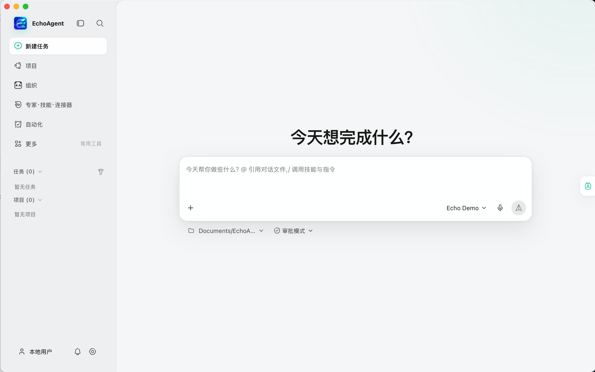
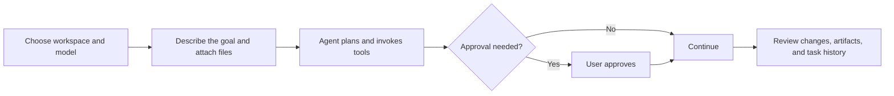
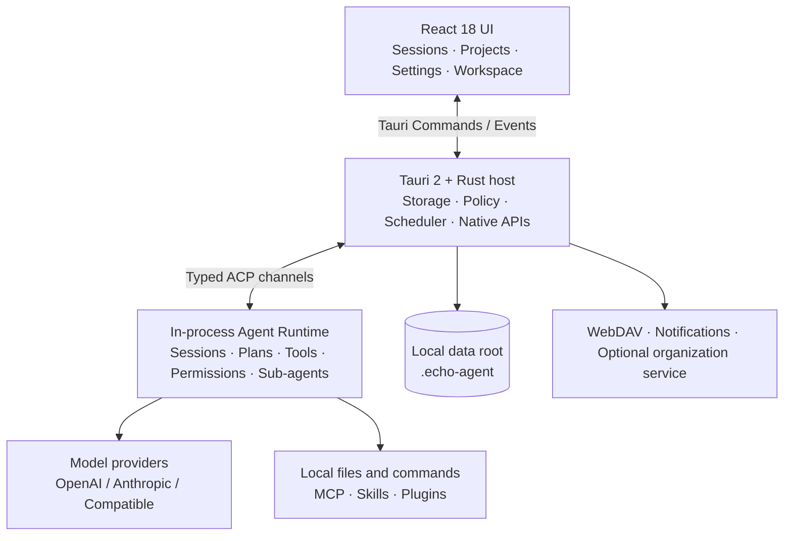

<p align="center">
  
</p>

<h1 align="center">EchoAgent</h1>

<p align="center">
  <strong>Give it a goal, not just a question.</strong>
  <br />
  An open-source, local-first desktop agent workspace that brings models, files, tools, memory, and automation into one native app.
</p>

<p align="center">
  <a href="README.md">中文</a>
  · <a href="#product">Product</a>
  · <a href="#quick-start">Quick start</a>
  · <a href="#capabilities">Capabilities</a>
  · <a href="#security-and-data-boundaries">Security</a>
  · <a href="#architecture">Architecture</a>
</p>

<p align="center">
  <a href="https://github.com/fuyuxiang/echo-agent-desktop/actions/workflows/ci.yml"></a>
  <a href="https://github.com/fuyuxiang/echo-agent-desktop/stargazers"></a>
  <a href="LICENSE"></a>
  
  
  
</p>

<p align="center">
  
</p>

## What is EchoAgent?

EchoAgent turns model APIs into a desktop agent that can do real work. It understands a goal, reads and changes files inside a real workspace, builds a plan, invokes local or MCP tools, and keeps the process, approval requests, file changes, and deliverables in one traceable task flow.

No EchoAgent cloud account is required. Bring your own OpenAI, Anthropic, DeepSeek, or Qwen credentials, or connect any compatible OpenAI- or Anthropic-style endpoint.

| Beyond chat | The EchoAgent workflow |
| --- | --- |
| Produces suggestions | Reads context, plans, uses tools, and delivers results |
| Accepts a one-off upload | Binds sessions to real directories and tracks changes and artifacts |
| Locks you to one model | Supports BYOK, multiple providers, and custom endpoints |
| Executes as a black box | Exposes folder trust, permission modes, approvals, and tool records |
| Starts from zero | Reuses project context, local history, memory, and knowledge sources |

> [!IMPORTANT]
> EchoAgent is currently at `0.3.10` and is evolving quickly before 1.0. Building from source is recommended today. Generated Windows and macOS packages are not yet code-signed or notarized.

## Product

<p align="center">
  
</p>

<p align="center"><sub>One task entry point: choose a workspace, model, and permission mode; attach files or capabilities; then describe the outcome.</sub></p>

### From goal to deliverable



While it works, you can inspect streaming output and tool cards, edit the plan, approve or reject sensitive actions, cancel execution, and rewind or fork from earlier points in a session.

## Why EchoAgent?

- **Workspace-native** — every session is attached to a real directory, with file trees, previews, unified diffs, artifacts, and history in one place.
- **Your models, your choice** — built-in provider presets plus compatible endpoints, with credentials and the model catalog controlled by you.
- **Composable capabilities** — MCP servers, skills, plugins, experts, and sub-agent teams can participate in both interactive tasks and automations.
- **Visible execution boundaries** — folder grants, approval/auto/always-allow modes, and allow/ask/deny policy rules govern tool execution.
- **Native without the bulk** — React handles interaction, Tauri and Rust provide native capabilities, and the agent runtime runs in-process.
- **Built for ongoing work** — projects, memory, knowledge bases, schedules, run history, and notification channels turn one task into a durable workflow.

## Quick start

### Prerequisites

| Dependency | Requirement |
| --- | --- |
| Node.js | 20 or newer; CI uses Node.js 22 |
| pnpm | 10; the expected version is pinned in the repository |
| Rust | Stable, minimum `1.92.0`, with `rustfmt` and `clippy` |
| Protocol Buffers | A native `protoc` on `PATH`, or a `PROTOC` environment variable |
| Platform toolchain | macOS: Xcode Command Line Tools. Windows: VS 2022 Build Tools with Desktop development with C++ and a Windows SDK |

Pinned sources for the core runtime, `async-openai`, and `nucleo` are committed under `vendor/`. A normal clone contains everything needed from those repositories; no Git submodule initialization is required.

### macOS

```bash
git clone https://github.com/fuyuxiang/echo-agent-desktop.git
cd echo-agent-desktop

pnpm setup:mac
pnpm install --frozen-lockfile
pnpm tauri dev
```

### Windows (PowerShell)

```powershell
git clone https://github.com/fuyuxiang/echo-agent-desktop.git
cd echo-agent-desktop

pnpm setup:win
pnpm install --frozen-lockfile
.\dev.bat
```

The first build compiles the complete embedded Rust runtime and will take longer than later incremental builds. See [Windows build notes](docs/WINDOWS_BUILD_NOTES.md) for MSVC, `protoc`, linker-memory, and packaging troubleshooting.

### Configure your first model

1. Start EchoAgent and open **Settings → Model**.
2. Choose a provider and enter your API key. Custom services also need an endpoint and protocol.
3. Add at least one model and optionally test the connection.
4. Return home, select a workspace, model, and permission mode, then send your first task.

<details>
<summary><strong>Configure with TOML</strong></summary>

The settings UI ultimately writes `~/.echo-agent/config.toml`. This is a minimal OpenAI-compatible example:

```toml
[models]
default = "your-model-id"

[model_providers.my-provider]
base_url = "https://your-endpoint.example/v1"
api_key = "YOUR_API_KEY"
api_backend = "chat_completions"
auth_scheme = "bearer"
context_window = 128000

[model.your-model-id]
model_provider = "my-provider"
name = "My Model"
```

Restart EchoAgent after editing the file manually. The settings UI is preferred for everyday use because it validates fields and preserves unrelated configuration.

</details>

## Capabilities

| Area | Implemented capabilities |
| --- | --- |
| **Agent workflows** | Streaming sessions, editable plans, slash commands, cancellation, rewind and fork, live sub-agent status, and teams |
| **Models** | OpenAI, Anthropic, DeepSeek, and Qwen presets; multiple providers and models; discovery; OpenAI- and Anthropic-compatible endpoints |
| **Tools and extensions** | MCP over stdio/HTTP, MCP OAuth, skills, plugins, connector catalogs, reusable experts, and local marketplaces |
| **Workspace** | Directory-scoped sessions, full-text search, pinning and archiving, file tree, common-document previews, change tracking, unified diffs, and project artifacts |
| **Projects** | Project instructions and templates, linked experts/skills/connectors, activity, plans, tasks, members, and deliverables |
| **Knowledge and memory** | Personal long-term memory, session summaries, local-folder knowledge sources, retrieval/consolidation controls, and an optional organization service |
| **Automation** | One-time and recurring schedules, manual test runs, execution history, workspace/model/expert/skill/connector selection, and per-task permissions |
| **Content experience** | Image and file attachments, drag and drop, voice input, GFM, syntax highlighting, KaTeX, Mermaid, tool-result images, and file previews |
| **Integrations** | WebDAV storage, desktop notifications, Slack, Discord, generic webhooks, and a unified notification center |
| **Governance and observability** | Folder trust, permission rules, feature policy, token usage, log directories, update checks, and optional OTLP telemetry |

## Security and data boundaries

EchoAgent stores application state under `~/.echo-agent/` by default. Set `ECHO_AGENT_HOME` before launch to use another data root.

| Data | Default location |
| --- | --- |
| Model, permission, and runtime configuration | `~/.echo-agent/config.toml` |
| MCP configuration | `~/.echo-agent/mcp.json` |
| Sessions and workspace history | `~/.echo-agent/sessions/` |
| Agents and skills | `~/.echo-agent/agents/`, `~/.echo-agent/skills/` |
| Memory and runtime state | `~/.echo-agent/memory/` and other EchoAgent JSON files |
| Expert, connector, and built-in skill catalogs | `~/.echo-agent/experts-marketplace/`, `~/.echo-agent/connectors-marketplace/`, `~/.echo-agent/resources/builtin-skills/` |

Understand these boundaries before use:

- Provider API keys are currently stored as plaintext in the local `config.toml`. EchoAgent tightens file permissions on Unix; Windows protection depends on the current user's ACL. Never commit, upload, or attach this file.
- Agent tools can read files, change files, and execute commands. Use Approval mode for untrusted repositories, grant only required directories, and inspect risky actions individually.
- “Local-first” describes application state and execution control, not full offline operation. Model, MCP, WebDAV, notification, and optional organization features contact their configured services.
- Memory is enabled by default. The current embedded runtime uses preset SiliconFlow endpoints for `BAAI/bge-m3` embeddings and `BAAI/bge-reranker-v2-m3` reranking. Review that implementation before handling sensitive content, or disable memory under **Settings → Memory**.
- Without an explicit workspace, EchoAgent creates and grants only an `EchoAgent` subdirectory under the operating system's Documents directory instead of implicitly authorizing the entire home directory.

On first launch, missing legacy data is copied safely from `~/.grok/`. Existing files in `~/.echo-agent/` are never overwritten, and the legacy directory is not removed.

## Architecture



The core runtime is not a separate sidecar. It lives on a dedicated OS thread backed by a current-thread Tokio runtime and `LocalSet`, communicating with the Rust bridge through in-memory ACP channels. The bridge converts streaming updates, permission requests, plan state, and completion events into Tauri events that frontend stores apply to the correct session.

```text
src/                       React UI, Zustand stores, and frontend domain logic
src-tauri/src/             Tauri commands, ACP bridge, policy, storage, scheduler
vendor/grok-build/         Pinned source snapshot of the embedded agent runtime
vendor/async-openai/       Vendored OpenAI-compatible Rust client
vendor/nucleo/             Vendored fuzzy-matching library
scripts/                   Setup, verification, build, and release scripts
docs/                      Platform build and desktop-update documentation
```

## Development and verification

| Command | Purpose |
| --- | --- |
| `pnpm tauri dev` | Run the complete desktop application |
| `pnpm dev` | Start only the Vite frontend; native Tauri capabilities are unavailable in a normal browser |
| `pnpm test` | Run frontend Vitest tests |
| `pnpm build` | Type-check TypeScript and build the frontend |
| `cargo test --locked --manifest-path src-tauri/Cargo.toml --lib -j 2` | Run Rust unit tests |
| `cargo fmt --manifest-path src-tauri/Cargo.toml --check` | Check Rust formatting |
| `cargo clippy --locked --manifest-path src-tauri/Cargo.toml --lib -- -D warnings` | Run Clippy |

CI runs frontend type checking, unit tests, the production build, Rust formatting, Clippy, and Rust unit tests for pushes to `main` and pull requests.

See [desktop updates](docs/desktop-updates.md) for the maintainer packaging and update workflow.

## Roadmap

- [ ] Signed, notarized, and automatically published Windows and macOS packages
- [ ] Validated Linux development and distribution support
- [ ] Officially maintained connector, skill, and plugin catalogs
- [ ] Desktop end-to-end tests and visual regression coverage
- [ ] Broader user documentation and UI internationalization

The roadmap is directional, not a release commitment. Follow the [issue tracker](https://github.com/fuyuxiang/echo-agent-desktop/issues) for current priorities.

## FAQ

<details>
<summary><strong>Can I use a local model?</strong></summary>

Yes, when the local service exposes an OpenAI- or Anthropic-compatible HTTP API. Add it as a custom provider and point the endpoint to the local service. Tool calling and multimodal support still depend on the specific model and server.

</details>

<details>
<summary><strong>Do I need an EchoAgent account?</strong></summary>

No for personal use. Models use your own credentials and primary state remains local. Organization features are an optional external-service integration.

</details>

<details>
<summary><strong>Does EchoAgent support Linux?</strong></summary>

No maintained Linux package is available yet. The frontend and most Rust modules are portable, but file dialogs, system notifications, and packaging still need platform adaptation and verification.

</details>

## Contributing

Contributions are welcome across bug fixes, tests, documentation, UI improvements, provider/MCP compatibility, and runtime capabilities.

1. Fork the repository and create a focused branch from `main`.
2. Keep changes scoped, and add tests and documentation for behavior changes.
3. Run the relevant frontend and Rust checks.
4. Open a pull request describing motivation, implementation, risk, and verification.

For larger features or architecture changes, open an issue first to discuss UX, compatibility, and security boundaries.

## Acknowledgements

- [xai-org/grok-build](https://github.com/xai-org/grok-build) provided the original Apache-2.0 runtime source. EchoAgent maintains a pinned, compatibility-modified snapshot in this repository.
- [Tauri](https://tauri.app/), [React](https://react.dev/), and [Vite](https://vite.dev/) form the core desktop application stack.

EchoAgent is an independent community open-source project and is not affiliated with, endorsed by, or sponsored by xAI.

## License

EchoAgent application code is released under the [MIT License](LICENSE). Vendored components and other third-party dependencies remain under their respective licenses; see [Third-Party Notices](THIRD_PARTY_NOTICES.md).
