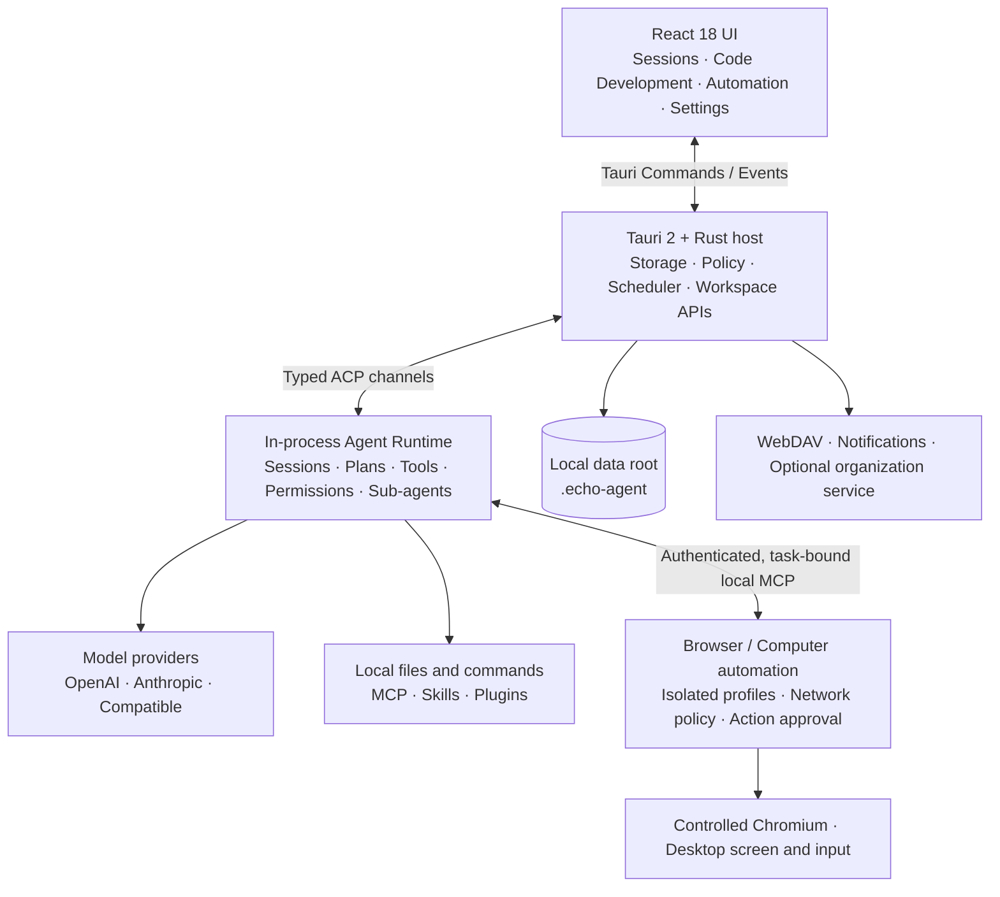

<p align="center">
  
</p>

<h1 align="center">EchoAgent</h1>

<p align="center">
  <strong>More than answers—give AI a real workspace and let it finish the job.</strong>
  <br />
  EchoAgent is an open-source, local-first desktop agent workspace. Connect the models you choose, let them understand projects, edit files, and use tools within explicit permissions, then review every deliverable.
</p>

<p align="center">
  <a href="README.md">中文</a>
  · <a href="#quick-start">Quick start</a>
  · <a href="#capabilities">Capabilities</a>
  · <a href="#execution-surfaces">Execution surfaces</a>
  · <a href="#how-it-works">How it works</a>
  · <a href="#data-and-security-boundaries">Security</a>
  · <a href="https://github.com/fuyuxiang/echo-agent-desktop/issues">Issues</a>
</p>

<p align="center">
  <a href="https://github.com/fuyuxiang/echo-agent-desktop/actions/workflows/ci.yml"></a>
  <a href="https://github.com/fuyuxiang/echo-agent-desktop/stargazers"></a>
  <a href="LICENSE"></a>
  
  
</p>

<p align="center">
  
</p>

<p align="center"><sub>The standard Agent home; current builds also let you switch to Browser Use or Computer Use when starting a task.</sub></p>

## From one goal to a reviewable deliverable

Real work rarely ends with one answer. It requires context, planning, tools, feedback, and a clear record of what changed. EchoAgent is designed around that entire loop instead of treating it as an add-on to chat.

| Principle | EchoAgent's design choice |
| --- | --- |
| **Workspace-native** | Sessions bind to real directories, keeping files, previews, search, changes, and artifacts in one context |
| **Transparent execution** | Plans, streaming output, tool calls, permission requests, and unified diffs stay visible and interruptible |
| **Models and capabilities stay modular** | Bring your own keys and combine models, MCP servers, skills, plugins, experts, and sub-agents as needed |
| **Built for ongoing collaboration** | Projects, memory, knowledge sources, and automation preserve context beyond a single conversation |

<p align="center">
  <strong>Goal → Context → Plan → Tool use → Approval → File changes → Deliverable</strong>
</p>

While a task runs, you can edit the plan, approve or reject sensitive actions, cancel execution, and rewind or fork from earlier points. The model moves the work forward; you retain control.

## Quick start

The repository includes the embedded Agent Runtime and pinned source snapshots of its dependencies. A normal clone is enough—no Git submodule initialization is required.

<details>
<summary><strong>Prerequisites</strong></summary>

| Dependency | Requirement |
| --- | --- |
| Node.js | 20 or newer; CI uses Node.js 22 |
| pnpm | 10; the expected version is pinned in the repository |
| Rust | Stable, minimum `1.92.0`, with `rustfmt` and `clippy` |
| Protocol Buffers | A native `protoc` on `PATH`, or a `PROTOC` environment variable |
| Platform toolchain | macOS: Xcode Command Line Tools. Windows: VS 2022 Build Tools with Desktop development with C++ and a Windows SDK |

</details>

### macOS

```bash
git clone https://github.com/fuyuxiang/echo-agent-desktop.git
cd echo-agent-desktop

pnpm setup:mac
pnpm install --frozen-lockfile
pnpm tauri dev
```

### Windows (PowerShell)

```powershell
git clone https://github.com/fuyuxiang/echo-agent-desktop.git
cd echo-agent-desktop

pnpm setup:win
pnpm install --frozen-lockfile
.\dev.bat
```

The first build compiles the complete Rust Runtime and takes longer than later incremental builds.

### Connect your first model

1. Start EchoAgent and open **Settings → Model**.
2. Choose a provider and enter your API key. Custom services also need an endpoint and protocol.
3. Add at least one model and optionally test the connection.
4. Return home, select a workspace, model, and permission mode, then send your first task.

<details>
<summary><strong>Configure with TOML</strong></summary>

The settings UI writes to `~/.echo-agent/config.toml`. This is a minimal OpenAI-compatible example:

```toml
[models]
default = "your-model-id"

[model_providers.my-provider]
base_url = "https://your-endpoint.example/v1"
api_key = "YOUR_API_KEY"
api_backend = "chat_completions"
auth_scheme = "bearer"
context_window = 128000

[model.your-model-id]
model = "your-model-id"
model_provider = "my-provider"
name = "My Model"
```

Restart EchoAgent after editing the file manually. The settings UI is recommended for everyday use because it validates fields and preserves unrelated configuration.

</details>

## Capabilities

| Area | Capabilities |
| --- | --- |
| **Agent execution** | Streaming sessions, native plans and tasks, slash commands, queued sends, cancellation, rewind and fork, live sub-agent status, and teams |
| **Coding workbench** | Monaco multi-tab editing, global search and replace, integrated terminal, cross-file symbol index, definition/reference/impact analysis, task DAGs, verification and diagnostics, diff review, checkpoint rollback, and evidence-backed delivery reports |
| **Browser and computer control** | Task-isolated Browser Use, screenshot-driven Computer Use, live capability detection, pause/takeover/resume controls, per-action risk confirmation, and task-level data cleanup |
| **Workspace** | Directory-scoped sessions, full-text search, file trees and safe file operations, common-document previews, change tracking, unified diffs, and deliverable assets |
| **Models** | OpenAI, Anthropic, DeepSeek, and Qwen presets; multiple providers and models; OpenAI- and Anthropic-compatible endpoints |
| **Extensions** | MCP over stdio, Streamable HTTP, or SSE; MCP OAuth; skills; plugins; CLI connectors; reusable experts; and local capability marketplaces |
| **Long-term context** | Project instructions, tasks and plans, personal memory, session summaries, hybrid retrieval over local Markdown/text/Office files, and an optional organization knowledge service |
| **Scheduled work and notifications** | One-time or hourly/daily/weekly/monthly/yearly schedules, run history, task-level model and permission settings, desktop notifications, Slack, Discord, and webhooks |
| **Projects and cloud storage** | Persisted project metadata and assets, task-artifact catalogs, local file browsing, and WebDAV browsing, transfers, and remote file management |
| **Content experience** | File and image attachments, drag and drop, voice input, GFM, syntax highlighting, KaTeX, Mermaid, and tool-result previews |

## Execution surfaces

### Agent, Browser Use, and Computer Use

The home screen exposes three execution modes from live backend capability detection rather than guessing from the operating-system name:

- **Agent** is the default for conversation, analysis, file editing, command execution, and MCP/skill workflows.
- **Browser Use** launches an independent per-task profile in Chrome, Edge, or Chromium. It can read DOM snapshots, capture screenshots, manage tabs and downloads, and navigate, click, fill, select, upload, press keys, scroll, and drag. Profiles and downloads are isolated by task and removed when that task is deleted.
- **Computer Use** captures a selected display to create a short-lived coordinate frame, then moves, clicks, drags, scrolls, types, or presses keys against that frame. UI-changing actions invalidate the old frame so stale coordinates cannot be reused.

Browser clicks, fills, selections, uploads, key presses, and drags—and desktop clicks, drags, typing, and key presses—always require an independent backend-generated confirmation. The model cannot self-declare an action safe. Password values are omitted from DOM snapshots, and Browser Use refuses to type into password fields; pause and take over manually when sign-in is required. Pausing cancels admitted actions and pending approvals, and restored automated tasks stay paused after an app restart.

Browser Use permits only public `http/https` destinations by default. Top-level navigation, subresources, and WebSockets all pass through a task-local proxy that rejects loopback, private, link-local, multicast, documentation, and reserved addresses. Private-network access must be explicitly enabled for the current task; revoking it closes old connections and leaves any open private page immediately. See the [Browser Use / Computer Use platform and security contract](docs/automation-platform-support.md) for the complete matrix.

> Page DOM, browser screenshots, and desktop screenshots become task context sent to the selected model provider. The automation UI keeps this boundary visible while either mode is active.

### Coding workbench

Open **More → Code Development** for a dedicated surface that brings projects, development tasks, Agent sessions, and code operations together:

- **Understand the repository:** scan languages, modules, manifests, project instructions, and Git state; incrementally maintain a cross-file symbol index for workspace-symbol search, go to definition, find references, and impact analysis.
- **Edit and operate:** use a multi-tab Monaco editor, file search and replace, create/rename/copy/move/trash actions, hot-exit draft recovery, and an integrated PTY terminal. Saves compare content hashes to detect concurrent edits from the Agent or another process.
- **Review task execution:** complex work becomes a DAG with dependencies, file scopes, contracts, acceptance criteria, and verification commands. The workbench advances phases from real diffs, process exit codes, and diagnostic fingerprints instead of accepting a model's completion claim as evidence.
- **Verify and deliver:** detect checks that really exist in Node.js, Rust, Maven/Gradle, Python, Go, CMake, Bazel, and .NET projects; stream their output and retain structured results. Plan-authored commands require one-time user approval, while known destructive commands are rejected by the native layer.
- **Protect changes:** Git repositories use HEAD plus the task-start state as a baseline; non-Git folders use a local filesystem checkpoint. You can review per-file diffs, discard one file, or roll back the task. Pre-existing dirty content is protected from automatic commits, and a delivery report becomes deliverable only after gates such as fresh verification, diff review, and acceptance evidence pass.

## How it works

EchoAgent is not a web wrapper around a command-line tool. The Agent Runtime runs inside the desktop process and communicates with the Tauri host over typed ACP channels. Rust owns session state, policy, scheduling, and native capabilities; React provides the interactive task surface.



The core Runtime comes from [**`echo-agent`**](https://github.com/fuyuxiang/echo-agent). Its entry crate is `echo-agent-runtime`, with a pinned source snapshot under `vendor/echo-agent-build/`. It runs on a dedicated OS thread backed by a current-thread Tokio Runtime and `LocalSet`; the bridge converts streaming updates, permission requests, and plan state into Tauri events routed to the correct session.

The Rust host owns and evaluates coding-task state, file baselines, the symbol index, verification records, and delivery gates, while the Agent Runtime understands and modifies the same authorized workspace. Browser and computer tools are exposed through a built-in MCP service that listens only on loopback, uses a process-scoped bearer token, and receives a trusted session ID injected by the Runtime. Automation state therefore cannot be selected by model arguments or shared across tasks.

```text
src/                       React UI, Zustand stores, and frontend domain logic
src/features/coding/       Coding workbench, editor, and task UI
src-tauri/src/             Tauri commands, ACP bridge, policy, storage, coding and automation backends
vendor/echo-agent-build/   Pinned source snapshot of the embedded Agent Runtime
vendor/async-openai/       Pinned OpenAI-compatible Rust client source
vendor/nucleo/             Pinned fuzzy-matching library source
scripts/                   Setup, verification, build, and release scripts
docs/                      Platform build and desktop-update documentation
```

## Data and security boundaries

EchoAgent stores application state under `~/.echo-agent/` by default. Set `ECHO_AGENT_HOME` before launch to use another data root. Folder trust, task permission modes, and allow/ask/deny rules work together to govern tool execution.

| Data | Default location |
| --- | --- |
| Model, permission, and runtime configuration | `~/.echo-agent/config.toml` |
| MCP configuration | `~/.echo-agent/mcp.json` |
| Organization sign-in hint (server and username) | `~/.echo-agent/organization-login-hint.json` |
| Sessions and workspace history | `~/.echo-agent/sessions/` |
| Agents, skills, and memory | `~/.echo-agent/agents/`, `~/.echo-agent/skills/`, `~/.echo-agent/memory/` |
| Personal knowledge index | `~/.echo-agent/personal-knowledge/` |
| Coding tasks, baselines, indexes, and verification records | `~/.echo-agent/coding/` |
| Browser Use task profiles and downloads | `~/.echo-agent/automation/browser-profiles/` |
| Projects, schedules, notifications, and other application metadata | `~/.echo-agent/echoagent-*.json` and `~/.echo-agent/projects/` |
| Expert, connector, and built-in skill catalogs | `~/.echo-agent/experts-marketplace/`, `~/.echo-agent/connectors-marketplace/`, `~/.echo-agent/resources/builtin-skills/` |

- Provider API keys are currently stored in the local `config.toml`. EchoAgent tightens file permissions on Unix; Windows protection depends on the current user's ACL. Never commit this file or attach it to a public issue.
- Organization passwords are never stored. Refresh credentials are protected by Keychain on macOS and current-user DPAPI on Windows, with an owner-only file fallback on other platforms; when a credential expires, only the non-secret server and username are retained for sign-in recovery.
- “Local-first” describes application state and execution control, not full offline operation. Model, MCP, WebDAV, notification, and optional organization features contact their configured services.
- Built-in chat uses `http://123.56.188.16:8088/v1` with `chat-xc`, `chat-glm`, and `chat-qwen`; `chat-xc` is the initial default. An organization model takes precedence after sign-in unless the user explicitly selects a default. Memory is enabled by default and uses `embed-pro` (1024 dimensions) and `rerank-pro` without an API key. This service currently uses plaintext HTTP; review the configuration before handling sensitive content, or disable memory under **Settings → Memory**.
- Personal model connections use HTTPS by default. For a service that only offers HTTP, explicitly enable HTTP for that connection in the connection editor. The API key, prompts, and responses then travel in plaintext. This setting does not change HTTPS connections or organization-managed model connections.

- Browser Use uploads only regular files inside the current task workspace and asks before disclosing any file to a website. Approval cards omit raw input text and URL query/fragment data, with Reject as the default focus.
- The coding workbench's file, index, and verification APIs operate only inside an authorized root and reject symlink escapes; its verification runner also rejects known destructive commands. Non-Git checkpoints exclude dependency caches, build outputs, and repository metadata. The integrated terminal is an interactive shell launched as the current user in the workspace and is not confined by those file-API boundaries.
- For untrusted repositories, use Approval mode, grant only the required directories, and inspect risky actions individually.

| Built-in chat model | Context window | Maximum input | Maximum output |
| --- | ---: | ---: | ---: |
| `chat-xc` | 262,144 | 253,952 | 8,192 |
| `chat-glm` | 131,072 | 122,880 | 8,192 |
| `chat-qwen` | 262,144 | 196,608 | 65,536 |

All limits are in tokens. Maximum input equals the context window minus maximum output. The runtime configures context and output limits per model.

## Development and verification

| Command | Purpose |
| --- | --- |
| `pnpm tauri dev` | Run the complete desktop application |
| `pnpm dev` | Start only the Vite frontend; native capabilities require the Tauri container |
| `pnpm test` | Run frontend Vitest tests |
| `pnpm build` | Type-check TypeScript and build the frontend |
| `pnpm dist:mac` | Build and validate a DMG on macOS |
| `pnpm dist:win` | Build an NSIS installer on Windows |
| `cargo test --locked --manifest-path src-tauri/Cargo.toml --lib -j 2` | Run Rust unit tests |
| `cargo fmt --manifest-path src-tauri/Cargo.toml --check` | Check Rust formatting |
| `cargo clippy --locked --manifest-path src-tauri/Cargo.toml --lib -- -D warnings` | Run Clippy |

CI runs frontend type checking, unit tests, the production build, Rust formatting, Clippy, and Rust unit tests for pushes to `main` and pull requests. Automation code also receives native compile or test coverage on macOS Intel/Apple Silicon, Windows, and Linux X11; the Browser Use smoke test that needs a real Chromium installation and desktop session remains an explicit test.

## Roadmap

- Smoother Windows and macOS release, installation, and update flows
- Linux platform adaptation and distribution
- Officially maintained connector, skill, and plugin catalogs
- Desktop end-to-end tests and visual regression coverage
- Broader user documentation and UI internationalization

The roadmap communicates direction rather than delivery commitments. Follow the [issue tracker](https://github.com/fuyuxiang/echo-agent-desktop/issues) for current priorities.

## FAQ

<details>
<summary><strong>Can I use a local model?</strong></summary>

Yes. Any local service exposing an OpenAI- or Anthropic-compatible HTTP API can be added as a custom provider. Tool calling and multimodal support still depend on the specific model and service.

</details>

<details>
<summary><strong>Do I need an EchoAgent account?</strong></summary>

Not for personal use. Models use your own credentials and primary state remains local. Organization features are an optional external-service integration.

</details>

<details>
<summary><strong>Does EchoAgent support Linux?</strong></summary>

Linux adaptation is in progress. The frontend and most Rust modules are portable; remaining work centers on file dialogs, system notifications, packaging, and platform verification.

The automation backend already compiles on Linux: Browser Use requires a Chromium-family browser, and Computer Use is enabled only in an X11 session with XTEST. Wayland explicitly refuses global capture and input injection. This does not mean an official Linux installer or full desktop release is available yet.

</details>

## Contributing

Contributions are welcome across bug fixes, tests, documentation, UI improvements, provider/MCP compatibility, and Runtime capabilities.

1. Fork the repository and create a branch focused on one issue from `main`.
2. Add relevant tests and documentation for behavior changes.
3. Run the frontend or Rust checks related to your change.
4. Open a pull request describing motivation, implementation, risk, and verification.

For larger features or architecture changes, open an issue first to discuss UX, compatibility, and security boundaries.

## Acknowledgements

EchoAgent is built with [Tauri](https://tauri.app/), [React](https://react.dev/), and [Vite](https://vite.dev/). The embedded Agent Runtime is maintained as a pinned source snapshot; provenance, compatibility changes, and third-party licenses are recorded in [Third-Party Notices](THIRD_PARTY_NOTICES.md).

## License

EchoAgent application code is released under the [MIT License](LICENSE). Vendored components and other third-party dependencies remain under their respective licenses; see [Third-Party Notices](THIRD_PARTY_NOTICES.md).
