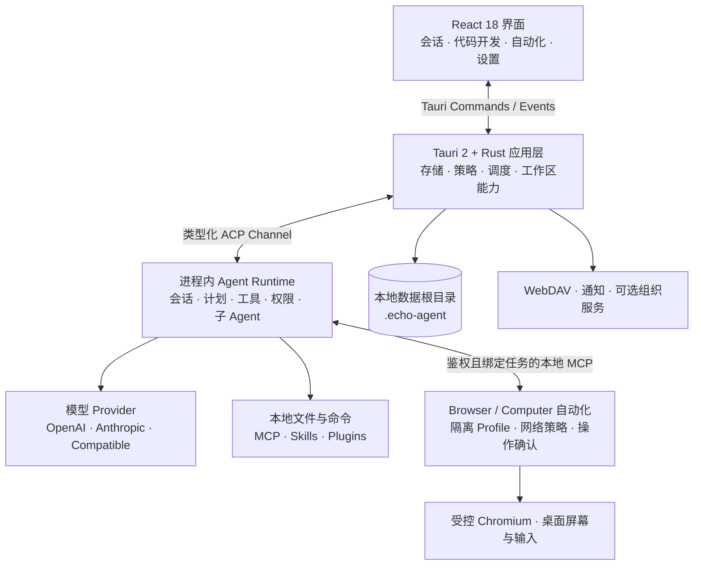

<p align="center">
  
</p>

<h1 align="center">EchoAgent</h1>

<p align="center">
  <strong>不止回答问题，让 AI 在真实工作区里把事情做完。</strong>
  <br />
  EchoAgent 是一个开源、本地优先的桌面 Agent 工作台：连接你选择的模型，在可控权限下理解项目、操作文件、调用工具，并把复杂目标推进为可审查的交付结果。
</p>

<p align="center">
  <a href="README.en.md">English</a>
  · <a href="#快速开始">快速开始</a>
  · <a href="#核心能力">核心能力</a>
  · <a href="#执行界面">执行界面</a>
  · <a href="#工作原理">工作原理</a>
  · <a href="#数据与安全边界">安全边界</a>
  · <a href="https://github.com/fuyuxiang/echo-agent-desktop/issues">Issues</a>
</p>

<p align="center">
  <a href="https://github.com/fuyuxiang/echo-agent-desktop/actions/workflows/ci.yml"></a>
  <a href="https://github.com/fuyuxiang/echo-agent-desktop/stargazers"></a>
  <a href="LICENSE"></a>
  
  
</p>

<p align="center">
  
</p>

<p align="center"><sub>标准 Agent 首页；当前版本还可在任务入口切换 Browser Use 与 Computer Use。</sub></p>

## 从一句目标，到一份可交付结果

真实工作很少止于一次问答。它需要理解上下文、拆解步骤、调用工具、处理反馈，还要让每一次操作都可以追踪。EchoAgent 围绕这条完整链路设计，而不是在聊天窗口外再堆一层功能。

| 原则 | EchoAgent 的设计选择 |
| --- | --- |
| **工作区原生** | 会话直接绑定真实目录，文件树、预览、搜索、变更和产物始终处于同一上下文 |
| **执行过程透明** | 计划、流式输出、工具调用、权限请求与 Unified Diff 都可查看和干预 |
| **模型与能力解耦** | 自带 API Key，按需组合不同模型、MCP、Skills、Plugins、专家与子 Agent |
| **面向持续协作** | 用项目、记忆、知识源与自动化沉淀上下文，让任务不必每次从零开始 |

<p align="center">
  <strong>目标 → 上下文 → 计划 → 工具执行 → 权限确认 → 文件变更 → 交付</strong>
</p>

任务执行期间，你可以调整计划，批准或拒绝敏感操作，随时取消执行，并从历史节点回溯或分叉会话。模型负责推进工作，最终控制权始终属于你。

## 快速开始

仓库已包含内嵌 Agent Runtime 及其锁定依赖的源码快照，正常克隆即可构建，无需初始化 Git Submodule。

<details>
<summary><strong>环境要求</strong></summary>

| 依赖 | 要求 |
| --- | --- |
| Node.js | 20 或更高版本；CI 使用 Node.js 22 |
| pnpm | 10；仓库已固定期望版本 |
| Rust | Stable，最低 `1.92.0`，包含 `rustfmt` 与 `clippy` |
| Protocol Buffers | 系统 `PATH` 中可用的原生 `protoc`，或设置 `PROTOC` |
| 平台工具链 | macOS：Xcode Command Line Tools；Windows：VS 2022 Build Tools、C++ 桌面工作负载和 Windows SDK |

</details>

### macOS

```bash
git clone https://github.com/fuyuxiang/echo-agent-desktop.git
cd echo-agent-desktop

pnpm setup:mac
pnpm install --frozen-lockfile
pnpm tauri dev
```

### Windows（PowerShell）

```powershell
git clone https://github.com/fuyuxiang/echo-agent-desktop.git
cd echo-agent-desktop

pnpm setup:win
pnpm install --frozen-lockfile
.\dev.bat
```

首次构建会编译完整的 Rust Runtime，因此会比后续增量构建耗时更长。

### 连接你的模型

1. 启动 EchoAgent，打开「设置 → 模型」。
2. 选择 Provider 并填写自己的 API Key；自定义服务还需配置 Endpoint 与协议。
3. 添加至少一个模型，可先测试连接。
4. 返回首页，选择工作目录、模型和权限模式，然后发送第一个任务。

<details>
<summary><strong>使用 TOML 手动配置</strong></summary>

设置界面最终写入 `~/.echo-agent/config.toml`。下面是一个最小的 OpenAI 兼容示例：

```toml
[models]
default = "your-model-id"

[model_providers.my-provider]
base_url = "https://your-endpoint.example/v1"
api_key = "YOUR_API_KEY"
api_backend = "chat_completions"
auth_scheme = "bearer"
context_window = 128000

[model.your-model-id]
model = "your-model-id"
model_provider = "my-provider"
name = "My Model"
```

手动修改后请重启 EchoAgent。日常使用更推荐设置界面，因为它会校验字段并在更新时保留无关配置。

</details>

## 核心能力

| 领域 | 能力 |
| --- | --- |
| **Agent 执行** | 流式会话、原生计划与任务、斜杠命令、队列发送、任务取消、历史回溯与分叉、子 Agent 实时状态和团队协作 |
| **代码开发工作台** | Monaco 多标签编辑、全局搜索与替换、集成终端、跨文件符号索引、定义/引用/影响分析、任务 DAG、验证与诊断、差异审阅、检查点回滚和证据化交付报告 |
| **浏览器与电脑操作** | 任务隔离的 Browser Use、基于屏幕快照的 Computer Use、实时能力检测、暂停/接管/恢复、逐项高风险确认与任务级数据清理 |
| **工作空间** | 目录级会话、全文检索、文件树与安全文件操作、常见文档预览、变更跟踪、Unified Diff 与交付资产 |
| **模型接入** | OpenAI、Anthropic、DeepSeek、通义千问预设，多 Provider、多模型，以及 OpenAI/Anthropic 兼容 Endpoint |
| **能力扩展** | MCP stdio/Streamable HTTP/SSE、MCP OAuth、Skills（含 [可执行能力契约](docs/skill-capability-manifest.md)）、Plugins、CLI 连接器、可复用专家与本地能力市场 |
| **长期上下文** | 项目指令、任务与计划、个人记忆、会话摘要、本地 Markdown/文本/Office 文件的混合检索索引，以及可选组织知识服务 |
| **定时任务与通知** | 单次或按小时/日/周/月/年周期调度、运行记录、任务级模型与权限、桌面通知、Slack、Discord 与 Webhook |
| **项目与云存储** | 持久化项目元数据和资产、任务产物归档、本地文件浏览，以及 WebDAV 存储源的浏览、上下传和远程文件管理 |
| **内容体验** | 文件与图片附件、拖拽、语音输入、GFM、语法高亮、KaTeX、Mermaid 和工具结果预览 |

## 执行界面

### Agent、Browser Use 与 Computer Use

首页会根据后端实时能力检测显示三种执行方式，而不是仅根据操作系统名称猜测可用性：

- **Agent** 是默认模式，面向对话、分析、文件编辑、命令执行和 MCP/Skill 工作流。
- **Browser Use** 会启动 Chrome、Edge 或 Chromium 的独立任务 Profile，可读取 DOM 快照、截图、管理标签页和下载，并执行导航、点击、填写、选择、上传、按键、滚动与拖动。Profile 和下载按任务隔离，删除任务时同步清理。
- **Computer Use** 会从指定显示器截图建立有效期有限的坐标帧，再执行鼠标移动、点击、拖动、滚动、文本输入和按键。界面变化后旧帧失效，避免继续使用过期坐标。

浏览器点击、填写、选择、上传、按键和拖动，以及桌面点击、拖动、输入和按键，均由后端强制生成独立确认，不依赖模型自报风险。密码字段不会进入 DOM 快照，Browser Use 也拒绝向密码框输入；需要登录时请暂停并手动接管。暂停会取消进行中操作和待确认请求，重启后恢复的自动化任务默认保持暂停。

> **关于「本任务始终允许」模式**：该模式仅对常规 Agent 工具调用生效。桌面上的点击 / 拖动 / 输入 / 按键（`computer_click` / `computer_drag` / `computer_type` / `computer_key`）与浏览器侧的同类操作仍会逐次弹出确认，避免 AI 在真实系统上造成不可逆后果（购买、删除、确认对话框、退出应用）。这一硬约束与权限模式正交，由后端 `automation::mod::ALWAYS_CONFIRM_TOOLS` 列表强制。

Browser Use 默认只允许公网 `http/https` 地址，顶层导航、子资源和 WebSocket 都经过任务本地代理，并拒绝环回、私网、链路本地和保留地址。只有用户为当前任务显式开启后才可访问内网；撤销授权会立即断开旧连接并离开已打开的内网页面。完整平台要求和安全契约见 [Browser Use / Computer Use 平台与安全契约](docs/automation-platform-support.md)。

> 网页 DOM、浏览器截图或桌面截图会作为当前任务上下文发送给所选模型服务商。界面会在自动化模式中持续提示这一边界。

### 代码开发工作台

从「更多 → 代码开发」打开独立工作台。它将项目、开发任务、Agent 会话和代码操作放在一个界面中：

- **理解工程**：扫描语言、模块、Manifest、项目指令和 Git 状态；增量维护跨文件符号索引，支持工作区符号、跳转定义、查找引用与影响分析。
- **编辑与操作**：Monaco 多标签编辑器、文件搜索/替换、新建/重命名/复制/移动/移入系统废纸篓、热退出草稿恢复和集成 PTY 终端。文件保存使用内容哈希检测 Agent 或外部程序造成的并发冲突。
- **可审查任务**：复杂任务被解析为带依赖、文件范围、契约、验收条件和验证命令的 DAG。工作台依据真实 Diff、进程退出码和诊断指纹推进阶段，不接受模型自报「已完成」作为交付证据。
- **验证与交付**：从 Node.js、Rust、Maven/Gradle、Python、Go、CMake、Bazel 和 .NET 工程中检测实际存在的构建、测试、Lint 和类型检查命令，流式展示输出并生成结构化记录。计划自定义命令需用户单次确认，高风险破坏性命令会在原生层被拒绝。
- **变更安全**：Git 工程基于 HEAD 与任务起始状态建立基线；非 Git 目录则使用本地文件检查点。可逐文件查看 Diff、丢弃或整体回滚；任务开始前已存在的未提交内容会标记保护，不会被自动提交。交付报告只在验证新鲜性、Diff 审阅和验收证据等门禁满足后标记可交付。

## 工作原理

EchoAgent 不是套在命令行工具外的 Web 壳。Agent Runtime 直接嵌入桌面进程，通过类型化 ACP Channel 与 Tauri 应用层通信；会话状态、权限策略、调度和原生能力由 Rust 承担，React 负责可交互的任务界面。



核心 Runtime 来自 [**`echo-agent`**](https://github.com/fuyuxiang/echo-agent)，入口 crate 为 `echo-agent-runtime`，锁定源码位于 `vendor/echo-agent-build/`。它运行在独立 OS 线程的 current-thread Tokio Runtime 与 `LocalSet` 中，Bridge 将流式更新、权限请求和计划状态转换为 Tauri Event，再分发到对应会话。

代码工作台的任务状态、文件基线、符号索引、验证记录和交付门禁由 Rust 应用层持久化和判定；Agent Runtime 在同一授权工作区内完成理解与修改。Browser/Computer 能力则通过仅监听环回地址、使用进程级 Bearer Token 并由 Runtime 注入信任会话 ID 的内置 MCP 服务暴露，自动化状态不由模型参数指定，也不会跨任务共享。

```text
src/                       React UI、Zustand Stores 与前端领域逻辑
src/features/coding/       代码开发工作台、编辑器与任务界面
src-tauri/src/             Tauri Commands、ACP Bridge、策略、存储、代码与自动化后端
vendor/echo-agent-build/   内嵌 Agent Runtime 的锁定源码快照
vendor/async-openai/       OpenAI 兼容 Rust 客户端源码快照
vendor/nucleo/             模糊匹配库源码快照
scripts/                   初始化、验证、构建与发布脚本
docs/                      平台构建与桌面更新文档
```

## 数据与安全边界

EchoAgent 默认将应用状态保存在 `~/.echo-agent/`；启动前设置 `ECHO_AGENT_HOME` 可以切换数据根目录。文件夹信任、任务权限模式以及允许/询问/拒绝规则共同约束工具执行。

| 数据 | 默认位置 |
| --- | --- |
| 模型、权限与运行配置 | `~/.echo-agent/config.toml` |
| MCP 配置 | `~/.echo-agent/mcp.json` |
| 组织登录提示（服务器与账号） | `~/.echo-agent/organization-login-hint.json` |
| 会话与工作空间历史 | `~/.echo-agent/sessions/` |
| Agents、Skills 与记忆 | `~/.echo-agent/agents/`、`~/.echo-agent/skills/`、`~/.echo-agent/memory/` |
| 个人知识索引 | `~/.echo-agent/personal-knowledge/` |
| 代码工作台任务、基线、索引与验证记录 | `~/.echo-agent/coding/` |
| Browser Use 任务 Profile 与下载 | `~/.echo-agent/automation/browser-profiles/` |
| 项目、定时任务与通知等应用元数据 | `~/.echo-agent/echoagent-*.json` 与 `~/.echo-agent/projects/` |
| 专家、连接器与内置技能目录 | `~/.echo-agent/experts-marketplace/`、`~/.echo-agent/connectors-marketplace/`、`~/.echo-agent/resources/builtin-skills/` |

- Provider API Key 当前保存在本机 `config.toml`。Unix 系统会收紧文件权限；Windows 的保护边界取决于当前用户 ACL。请勿将该文件提交到版本控制或附加到公开 Issue。
- 组织密码不会保存。用于自动续期的凭据在 macOS 上由 Keychain 保护，在 Windows 上由当前用户 DPAPI 保护，其他平台回退到仅当前用户可读的本地文件；凭据失效后仅保留非敏感的服务器和账号以便重新登录。
- “本地优先”指应用状态与执行控制位于本机，不代表完全离线。模型、MCP、WebDAV、通知和可选组织能力会访问各自配置的服务。
- 记忆默认开启；当前 Runtime 使用预设的 SiliconFlow Endpoint 完成 `BAAI/bge-m3` 向量化与 `BAAI/bge-reranker-v2-m3` 重排。处理敏感内容前请审查相关配置，或在「设置 → 记忆」中关闭。
- Browser Use 仅允许上传当前任务工作区内的普通文件，且在向网站披露任何文件前要求确认。自动化确认卡不显示输入原文、URL query 或 fragment，拒绝是默认焦点。
- 代码工作台的文件、索引和验证 API 仅在已授权根目录内工作，拒绝符号链接逃逸，验证运行器还会拒绝已知破坏性命令；非 Git 检查点不包含依赖缓存、构建产物和版本库元数据。集成终端是以当前用户身份、从工作区启动的交互式 Shell，不受上述文件 API 边界限制。
- 对来源未知的仓库，建议使用「审批模式」、只授权必要目录，并逐项检查风险操作。

## 开发与验证

| 命令 | 用途 |
| --- | --- |
| `pnpm tauri dev` | 运行完整桌面应用 |
| `pnpm dev` | 仅启动 Vite 前端；原生能力需要 Tauri 容器 |
| `pnpm test` | 运行 Vitest 前端测试 |
| `pnpm build` | TypeScript 类型检查并构建前端 |
| `pnpm dist:mac` | 在 macOS 上构建并校验 DMG |
| `pnpm dist:win` | 在 Windows 上构建 NSIS 安装包 |
| `cargo test --locked --manifest-path src-tauri/Cargo.toml --lib -j 2` | 运行 Rust 单元测试 |
| `cargo fmt --manifest-path src-tauri/Cargo.toml --check` | 检查 Rust 格式 |
| `cargo clippy --locked --manifest-path src-tauri/Cargo.toml --lib -- -D warnings` | 运行 Clippy |

CI 会在 `main` 推送和 Pull Request 上执行前端类型检查、单元测试、生产构建，以及 Rust 格式、Clippy 和单元测试。自动化模块另在 macOS Intel/Apple Silicon、Windows 和 Linux X11 环境做原生编译或测试；需要真实 Chromium 和桌面会话的 Browser Use smoke test 保持为显式运行项。

## 路线图

- 更顺畅的 Windows 与 macOS 发布、安装和更新体验
- Linux 平台适配与分发
- 官方维护的 Connector、Skill 与 Plugin 目录
- 桌面端端到端测试与视觉回归测试
- 更完整的用户文档与界面国际化

路线图用于说明方向，不代表交付承诺；当前优先级以 [Issue Tracker](https://github.com/fuyuxiang/echo-agent-desktop/issues) 为准。

## 常见问题

<details>
<summary><strong>支持本地模型吗？</strong></summary>

支持。只要本地服务提供兼容 OpenAI 或 Anthropic 的 HTTP API，即可作为自定义 Provider 接入。工具调用和多模态能力取决于具体模型及服务实现。

</details>

<details>
<summary><strong>需要 EchoAgent 账户吗？</strong></summary>

个人使用不需要。模型使用你自己的凭证，主要状态保存在本机；组织能力是可选的外部服务入口。

</details>

<details>
<summary><strong>支持 Linux 吗？</strong></summary>

Linux 仍在适配中。前端和多数 Rust 模块具备可移植性，后续工作集中在文件对话框、系统通知、打包流程和平台验证。

自动化底层已在 Linux 上编译：Browser Use 需要 Chromium 系浏览器，Computer Use 仅在具备 XTEST 的 X11 会话启用，Wayland 会明确拒绝全局截屏与输入注入。这不等于 Linux 已有官方安装包或完整桌面发布支持。

</details>

## 参与贡献

欢迎提交 Bug 修复、测试、文档、界面改进、Provider/MCP 兼容性和 Runtime 能力增强。

1. Fork 仓库，并从 `main` 创建聚焦单一问题的分支。
2. 为行为变化补充相应测试和文档。
3. 运行与改动相关的前端或 Rust 检查。
4. 创建 Pull Request，说明动机、实现、风险与验证结果。

较大的功能或架构调整建议先创建 Issue，提前讨论交互、兼容性与安全边界。

## 致谢

EchoAgent 基于 [Tauri](https://tauri.app/)、[React](https://react.dev/) 与 [Vite](https://vite.dev/) 构建。内嵌 Agent Runtime 以固定源码快照维护，来源、兼容性修改和第三方许可记录在 [第三方许可说明](THIRD_PARTY_NOTICES.md) 中。

## 许可证

EchoAgent 应用代码基于 [MIT License](LICENSE) 开源。Vendored 组件与其他第三方依赖继续遵循各自原始许可证，详见 [第三方许可说明](THIRD_PARTY_NOTICES.md)。
