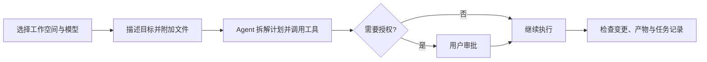
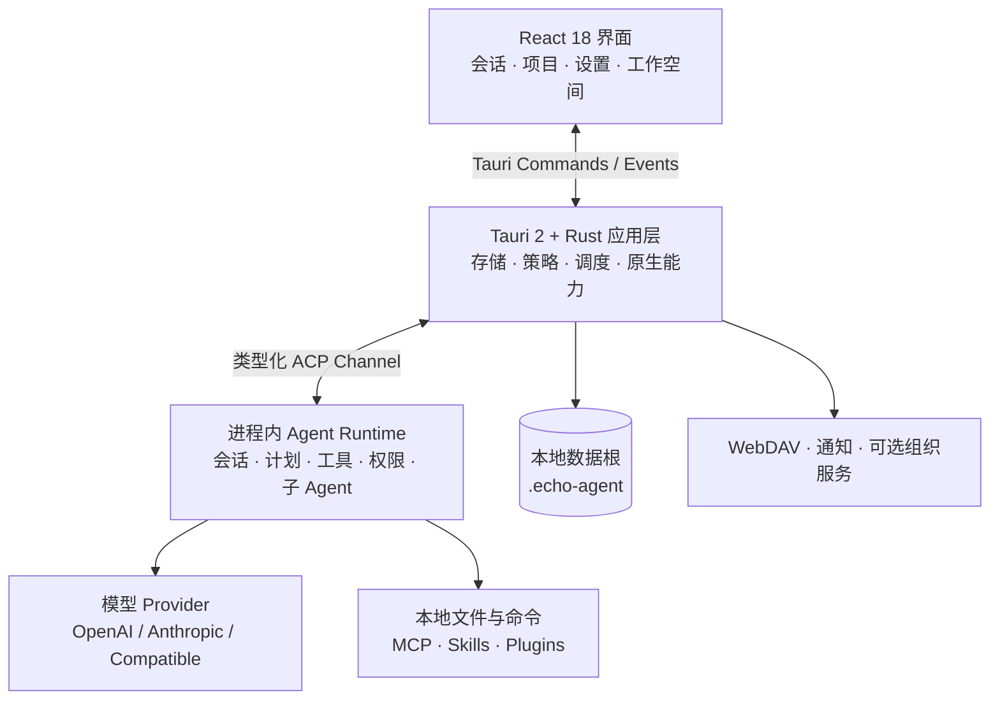

<p align="center">
  
</p>

<h1 align="center">EchoAgent</h1>

<p align="center">
  <strong>让 AI Agent 从目标出发，持续推进到交付。</strong>
  <br />
  一款开源、本地优先的桌面 Agent 工作台，把模型、文件、工具、记忆与自动化放进同一个原生应用。
</p>

<p align="center">
  <a href="README.en.md">English</a>
  · <a href="#产品界面">产品界面</a>
  · <a href="#快速开始">快速开始</a>
  · <a href="#核心能力">核心能力</a>
  · <a href="#安全与数据边界">安全与数据边界</a>
  · <a href="#技术架构">技术架构</a>
</p>

<p align="center">
  <a href="https://github.com/fuyuxiang/echo-agent-desktop/actions/workflows/ci.yml"></a>
  <a href="https://github.com/fuyuxiang/echo-agent-desktop/stargazers"></a>
  <a href="LICENSE"></a>
  
  
  
</p>

<p align="center">
  
</p>

## EchoAgent 是什么？

EchoAgent 将模型 API 接入真实工作空间，让 Agent 可以理解目标、读写文件、拆解计划、调用本地工具或 MCP，并将执行过程、权限请求、文件变更和最终产物汇总到一条可追踪的任务链中。

个人使用采用 BYOK 模式，可直接接入 OpenAI、Anthropic、DeepSeek、通义千问，也可连接兼容 OpenAI 或 Anthropic 协议的服务。

| 使用环节 | EchoAgent 工作闭环 |
| --- | --- |
| 目标理解 | 读取上下文、制定计划、调用工具并交付结果 |
| 文件协作 | 会话绑定真实目录，持续跟踪文件、变更与产物 |
| 模型连接 | BYOK、多 Provider、多模型与自定义 Endpoint |
| 执行控制 | 文件夹信任、权限模式、行内审批与工具调用记录 |
| 持续协作 | 复用项目上下文、本地历史、个人记忆与知识源 |

> [!IMPORTANT]
> EchoAgent 当前版本为 `0.3.10`，仍处于 1.0 之前的快速迭代期。现阶段推荐从源码体验；Windows/macOS 安装包的代码签名与公证仍在准备中。

## 产品界面

<p align="center">
  
</p>

<p align="center"><sub>统一任务入口：选择工作空间、模型与权限模式，附加文件或能力，然后直接描述目标。</sub></p>

### 从目标到交付



整个过程中，你可以查看流式输出和工具卡片、调整计划、批准或拒绝敏感操作、取消任务，并从历史节点回溯或分叉会话。

## 为什么选择 EchoAgent？

- **工作空间原生**：每个会话都绑定真实目录；文件树、预览、Unified Diff、产物与历史在同一界面中完成闭环。
- **模型由你决定**：内置常见 Provider 预设，同时保留兼容 Endpoint；凭证和模型目录由用户自己管理。
- **能力可以组合**：MCP、Skills、Plugins、专家和子 Agent 团队可统一加入交互任务与自动化流程。
- **执行边界可见**：工作目录授权、审批/自动/始终允许三种权限模式，以及允许/询问/拒绝规则共同控制工具执行。
- **原生且轻量**：React 负责交互，Tauri 与 Rust 承担原生能力，Agent Runtime 直接运行在应用进程中。
- **为持续工作设计**：项目、记忆、知识库、定时任务、运行记录和通知渠道让一次任务能够发展为长期工作流。

## 快速开始

### 环境要求

| 依赖 | 要求 |
| --- | --- |
| Node.js | 20 或更高版本；CI 使用 Node.js 22 |
| pnpm | 10；仓库已固定期望版本 |
| Rust | Stable，最低 `1.92.0`；包含 `rustfmt` 与 `clippy` |
| Protocol Buffers | 系统 `PATH` 中可用的原生 `protoc`，或设置 `PROTOC` |
| 平台工具链 | macOS：Xcode Command Line Tools；Windows：VS 2022 Build Tools、C++ 桌面工作负载和 Windows SDK |

### macOS

```bash
git clone https://github.com/fuyuxiang/echo-agent-desktop.git
cd echo-agent-desktop

pnpm setup:mac
pnpm install --frozen-lockfile
pnpm tauri dev
```

### Windows（PowerShell）

```powershell
git clone https://github.com/fuyuxiang/echo-agent-desktop.git
cd echo-agent-desktop

pnpm setup:win
pnpm install --frozen-lockfile
.\dev.bat
```

首次构建会编译完整的内嵌 Rust Runtime，通常比后续增量构建耗时更长。Windows 上遇到 MSVC、`protoc`、链接器内存或打包工具问题，请查看 [Windows 构建说明](docs/WINDOWS_BUILD_NOTES.md)。

### 配置第一个模型

1. 启动 EchoAgent，打开「设置 → 模型」。
2. 选择 Provider，填写自己的 API Key；自定义服务还需填写 Endpoint 与协议。
3. 添加至少一个模型，并可先测试连接。
4. 返回首页，选择工作目录、模型和权限模式，然后发送第一个任务。

<details>
<summary><strong>使用 TOML 手动配置</strong></summary>

设置界面最终写入 `~/.echo-agent/config.toml`。下面是一个最小的 OpenAI 兼容示例：

```toml
[models]
default = "your-model-id"

[model_providers.my-provider]
base_url = "https://your-endpoint.example/v1"
api_key = "YOUR_API_KEY"
api_backend = "chat_completions"
auth_scheme = "bearer"
context_window = 128000

[model.your-model-id]
model_provider = "my-provider"
name = "My Model"
```

手动修改后请重启 EchoAgent。日常使用更推荐设置界面，因为它会校验字段并在更新时保留无关配置。

</details>

## 核心能力

| 领域 | 已实现能力 |
| --- | --- |
| **Agent 工作流** | 流式会话、可编辑计划、斜杠命令、取消执行、回溯与分叉、子 Agent 实时状态和团队协作 |
| **模型接入** | OpenAI、Anthropic、DeepSeek、通义千问预设，多 Provider、多模型、模型发现，以及 OpenAI/Anthropic 兼容 Endpoint |
| **工具与扩展** | MCP stdio/HTTP、MCP OAuth、Skills、Plugins、连接器目录、可复用专家和本地能力市场 |
| **工作空间** | 目录级会话、全文检索、置顶与归档、文件树、常见文档预览、变更跟踪、Unified Diff 与项目资产 |
| **项目管理** | 项目指令、模板、关联专家/技能/连接器、动态、计划、任务、成员和交付资产 |
| **知识与记忆** | 个人长期记忆、会话摘要、本地文件夹知识源、记忆检索/落盘/整理，以及可选组织知识服务 |
| **自动化** | 单次或周期调度、手动试运行、执行记录、工作空间/模型/专家/技能/连接器选择和任务级权限模式 |
| **内容体验** | 图片与文件附件、拖拽、语音输入、GFM、语法高亮、KaTeX、Mermaid、工具结果图片和文件预览 |
| **集成与通知** | WebDAV 云存储、桌面通知、Slack、Discord、通用 Webhook 和统一通知中心 |
| **治理与可观测** | 文件夹信任、权限规则、功能策略、Token 用量、日志目录、更新检查与可选 OTLP 遥测 |

## 安全与数据边界

EchoAgent 默认把状态放在 `~/.echo-agent/`。启动前设置 `ECHO_AGENT_HOME` 可以切换数据根目录。

| 数据 | 默认位置 |
| --- | --- |
| 模型、权限与运行配置 | `~/.echo-agent/config.toml` |
| MCP 配置 | `~/.echo-agent/mcp.json` |
| 会话与工作空间历史 | `~/.echo-agent/sessions/` |
| Agents 与 Skills | `~/.echo-agent/agents/`、`~/.echo-agent/skills/` |
| 记忆与 Runtime 状态 | `~/.echo-agent/memory/` 及其他 EchoAgent JSON 文件 |
| 专家、连接器与内置技能目录 | `~/.echo-agent/experts-marketplace/`、`~/.echo-agent/connectors-marketplace/`、`~/.echo-agent/resources/builtin-skills/` |

请在使用前了解这些边界：

- Provider API Key 当前以明文写入本机 `config.toml`。Unix 系统会尽量收紧文件权限；Windows 的边界取决于当前用户 ACL。请将该文件排除在版本控制、Issue 附件和公开日志之外。
- Agent 工具可以读取文件、修改文件和运行命令。处理来源未知的仓库时，建议使用「审批模式」，限定授权目录，并逐项检查风险操作。
- “本地优先”覆盖应用状态与执行控制。模型、MCP、WebDAV、通知和可选组织能力仍会访问各自配置的服务。
- 记忆功能默认开启；当前内嵌 Runtime 会使用预设的 SiliconFlow Endpoint 完成 `BAAI/bge-m3` 向量化和 `BAAI/bge-reranker-v2-m3` 重排。处理敏感内容前请审查该实现，或在「设置 → 记忆」中关闭记忆能力。
- 未指定工作目录时，默认授权范围限定为系统“文稿”目录下的 `EchoAgent` 子目录。

## 技术架构



核心 Runtime 直接嵌入桌面进程，运行在独立 OS 线程上的 current-thread Tokio Runtime 与 `LocalSet` 中，并通过内存内 ACP Channel 与 Rust Bridge 通信。Bridge 将流式更新、权限请求、计划状态和完成事件转换成 Tauri Event，再由前端 Store 分发到对应会话。

## 开发与验证

| 命令 | 用途 |
| --- | --- |
| `pnpm tauri dev` | 运行完整桌面应用 |
| `pnpm dev` | 仅启动 Vite 前端；Tauri 原生能力需在桌面容器中运行 |
| `pnpm test` | 运行 Vitest 前端测试 |
| `pnpm build` | TypeScript 类型检查并构建前端 |
| `cargo test --locked --manifest-path src-tauri/Cargo.toml --lib -j 2` | 运行 Rust 单元测试 |
| `cargo fmt --manifest-path src-tauri/Cargo.toml --check` | 检查 Rust 格式 |
| `cargo clippy --locked --manifest-path src-tauri/Cargo.toml --lib -- -D warnings` | 运行 Clippy |

CI 会对 `main` 推送和 Pull Request 执行前端类型检查、单元测试、生产构建，以及 Rust 格式、Clippy 和单元测试检查。

桌面更新与维护者发版流程见 [桌面更新文档](docs/desktop-updates.md)。

## 路线图

- [ ] Windows 与 macOS 安装包签名、公证和自动发布
- [ ] Linux 开发验证与正式分发
- [ ] 官方维护的 Connector、Skill 与 Plugin 目录
- [ ] 桌面端到端测试和视觉回归测试
- [ ] 更完整的用户文档与界面国际化

路线图用于说明项目方向，具体交付与当前优先级以 [Issue Tracker](https://github.com/fuyuxiang/echo-agent-desktop/issues) 为准。

## 常见问题

<details>
<summary><strong>支持本地模型吗？</strong></summary>

可以。本地服务需提供兼容 OpenAI 或 Anthropic 的 HTTP API。将其添加为自定义 Provider，并把 Endpoint 指向本地地址即可。工具调用与多模态能力取决于具体模型和服务实现。

</details>

<details>
<summary><strong>需要 EchoAgent 账户吗？</strong></summary>

个人使用采用 BYOK 模式，可直接配置自己的模型凭证，主要状态保存在本机；“组织”能力作为可选的外部服务入口提供。

</details>

<details>
<summary><strong>支持 Linux 吗？</strong></summary>

Linux 支持目前处于适配阶段。前端和多数 Rust 模块已经具备可移植性，后续工作集中在文件对话框、系统通知、打包流程和平台验证。

</details>

## 参与贡献

欢迎提交 Bug 修复、测试、文档、界面改进、Provider/MCP 兼容性和 Runtime 能力增强。

1. Fork 仓库，并从 `main` 创建独立分支。
2. 保持改动聚焦，为行为变化补充测试和文档。
3. 运行与改动相关的前端/Rust 检查。
4. 创建 Pull Request，说明动机、实现、风险与验证结果。

较大的功能或架构调整建议先创建 Issue，提前讨论交互、兼容性和安全边界。

## 许可证

EchoAgent 应用代码基于 [MIT License](LICENSE) 开源。Vendored 组件与其他第三方依赖继续遵循各自原始许可证，详见 [第三方许可说明](THIRD_PARTY_NOTICES.md)。
