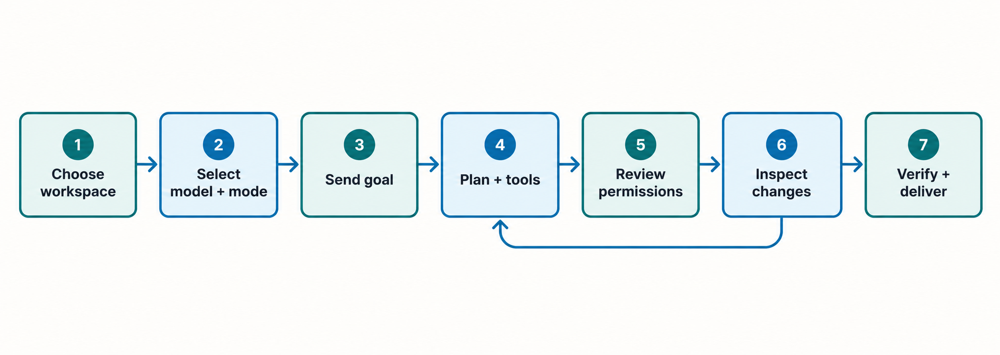
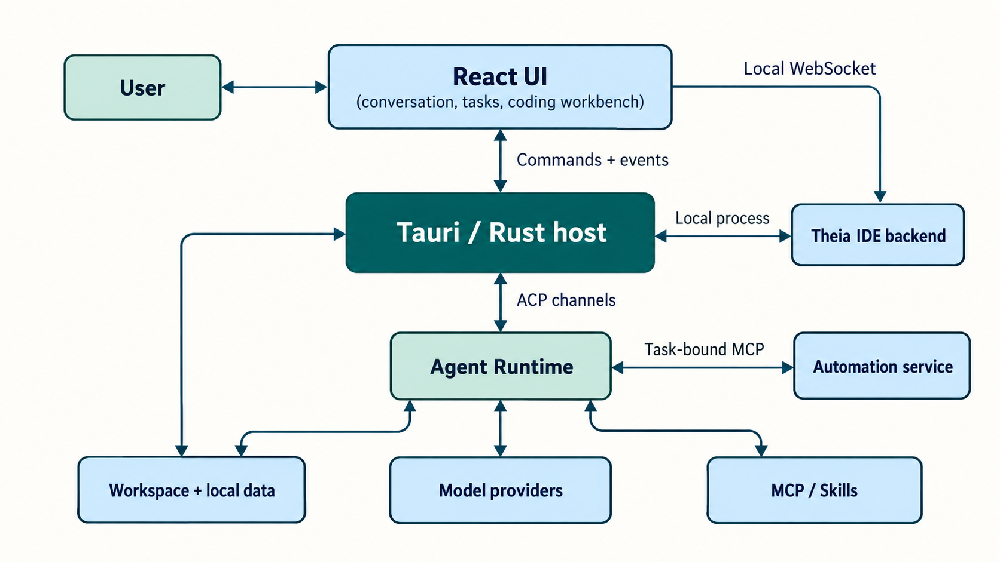

<p align="center"></p>

<h1 align="center">EchoAgent</h1>

<p align="center"><strong>让 AI 在真实工作区中完成任务，并让每一步都可查看、可控制。</strong><br />开源、本地优先的桌面 Agent 工作台，集成对话、工具执行、代码开发与任务交付。</p>

<p align="center"><a href="README.en.md">English</a> · <a href="#快速开始">快速开始</a> · <a href="#主要能力">主要能力</a> · <a href="#架构与数据流">架构</a> · <a href="#参与贡献">参与贡献</a> · <a href="https://github.com/fuyuxiang/echo-agent-desktop/issues">反馈问题</a></p>

<p align="center"><a href="https://github.com/fuyuxiang/echo-agent-desktop/actions/workflows/ci.yml"></a> <a href="LICENSE"></a>  </p>

<p align="center"></p>

EchoAgent 将会话绑定到实际工作目录。你可以选择模型和权限模式，提出目标，随后在同一桌面应用中查看 Agent 的计划、工具调用、文件变更和结果。应用状态主要保存在本机；模型推理及按需启用的外部服务仍需要网络连接。

## 主要能力

| 场景 | 当前实现 |
| --- | --- |
| **Agent 任务** | 流式对话、计划与任务、工具调用、权限审批、会话历史、回溯与分叉、子 Agent 状态。 |
| **代码开发** | 内嵌 Eclipse Theia IDE，提供编辑器、文件树、搜索、终端、Git 和预览；Echo Code 管理任务阶段、Diff 审阅、验证与交付。 |
| **浏览器与桌面操作** | Browser Use 使用任务独立的浏览器资料；Computer Use 基于截图与坐标帧操作桌面。能力由当前设备实时检测，关键交互需要确认。 |
| **模型与扩展** | 内置远端模型和自定义模型连接；支持 MCP、Skills、Plugins、连接器与专家。 |
| **知识与办公** | 本地知识索引、项目上下文、记忆；在任务中读取常见文件，并在本机生成 Word、PDF、Excel 和 PowerPoint。 |
| **持续工作** | 项目与工作项、定时任务、通知、会议录音与纪要，以及可选的微信远程会话和组织服务。 |

进一步了解：[Echo Code](docs/echo-code-theia.md) · [Browser Use / Computer Use](docs/automation-platform-support.md) · [办公文档](docs/office-documents.md) · [实时信息](docs/live-information.md) · [微信远程会话](docs/weixin-remote.md) · [Skill 能力声明](docs/skill-capability-manifest.md)

## 快速开始

### 安装桌面应用

从项目的 [GitHub Releases](https://github.com/fuyuxiang/echo-agent-desktop/releases) 获取与你的系统和处理器架构匹配的安装包。桌面发行目标为 **Windows x86_64**、**macOS Apple Silicon** 和 **macOS Intel**。发行页没有适用安装包时，可按下文从源码运行。Linux 目前没有正式桌面发行包。

### 从源码运行

构建需要 Node.js **22 或 24**、pnpm **10**、Rust **1.92.0+**（stable）、Protocol Buffers 编译器 `protoc`，以及对应平台的原生工具链。macOS 需要 Xcode Command Line Tools；Windows 需要 Visual Studio 2022 C++ 构建工具和 Windows SDK。完整的内嵌 Agent Runtime 源码已经随仓库提交，无需初始化 submodule。

**macOS**

```bash
git clone https://github.com/fuyuxiang/echo-agent-desktop.git
cd echo-agent-desktop
pnpm setup:mac
pnpm install --frozen-lockfile
pnpm tauri dev
```

**Windows（PowerShell）**

```powershell
git clone https://github.com/fuyuxiang/echo-agent-desktop.git
cd echo-agent-desktop
pnpm setup:win
pnpm install --frozen-lockfile
.\dev.bat
```

首次启动会构建并暂存内嵌 Theia IDE、Office Worker 和 Rust Runtime，可能需要较长时间。`pnpm tauri dev` 运行完整桌面应用；`pnpm dev` 只启动 Vite 前端。

### 创建第一个任务

1. 在首页选择工作目录、模型和权限模式。
2. 输入目标并发送；如果任务要读写文件，请选择实际要授权的目录。
3. 查看计划与工具执行过程，按需处理权限请求；有文件修改时检查 Diff 和验证结果。

应用提供内置模型，**无需填写个人 API Key，但推理会访问项目配置的远端服务**。若要使用自己的模型，在「设置 → 模型」中添加连接、模型并测试。自定义连接支持 OpenAI、Anthropic 及其兼容接口；模型的工具调用等能力取决于实际服务。个人模型配置保存在本机 `~/.echo-agent/config.toml`。

<p align="center"></p>

<p align="center"><sub>图示为涉及文件修改的典型路径；没有权限请求或文件变更时，可跳过相应步骤。</sub></p>

## 架构与数据流

EchoAgent 使用 React 18 构建界面，Tauri 2 与 Rust 负责桌面能力、状态和进程管理。Agent Runtime 作为**进程内组件**运行，通过类型化 ACP Channel 与宿主通信。Echo Code 的 Theia 后端由宿主启动为本机进程；浏览器和电脑操作通过绑定当前任务的本地 MCP 服务交给 Runtime 使用。

<p align="center"></p>

| 目录 | 职责 |
| --- | --- |
| [`src/`](src/) | React 界面、状态管理与前端领域逻辑。 |
| [`src-tauri/src/`](src-tauri/src/) | Tauri 命令、ACP 桥接、策略、存储、代码工作台和自动化后端。 |
| [`vendor/echo-agent-build/`](vendor/echo-agent-build/) | 锁定的内嵌 Agent Runtime 源码快照。 |
| [`vendor/theia-platform/`](vendor/theia-platform/) | Eclipse Theia 源码及 IDE 集成。 |
| [`scripts/`](scripts/) · [`docs/`](docs/) | 构建、验证、发行脚本与专题文档。 |

### 数据与权限边界

- 默认数据根目录是 `~/.echo-agent/`，可在启动前通过 `ECHO_AGENT_HOME` 调整。模型配置位于 `config.toml`，MCP 配置位于 `mcp.json`，会话与工作台状态存放在该根目录下的对应子目录。
- Provider API Key 保存在本机配置文件中。请保护该文件，避免将其提交到仓库或附在公开 Issue 中。个人模型连接默认要求 HTTPS；内置模型使用项目配置的远端 HTTP 服务。
- “本地优先”不等于离线。发送给模型的任务内容，以及启用 Browser Use / Computer Use 后提供的网页内容或屏幕截图，会到达所选模型服务；MCP、通知、云存储和可选组织能力也可能访问外部服务。
- 工作区授权、权限模式与操作确认共同控制 Agent 行为。Browser Use 默认限制私网访问；Computer Use 的点击、拖动、输入与按键即使处于「始终允许」模式也逐次确认。Theia 的交互终端以当前系统用户身份运行，应审查来源未知项目中的命令。

详细的平台条件与操作边界见 [自动化安全说明](docs/automation-platform-support.md)。

## 开发

| 命令 | 用途 |
| --- | --- |
| `pnpm tauri dev` | 启动完整桌面应用，并自动准备 Theia 与 Office Worker。 |
| `pnpm test` | 运行前端 Vitest 测试。 |
| `pnpm build` | TypeScript 类型检查与前端生产构建。 |
| `pnpm office:test` | 验证内置文档生成器。 |
| `cargo test --locked --manifest-path src-tauri/Cargo.toml --lib --tests -j 2` | 运行 Rust 单元与集成测试。 |
| `cargo fmt --manifest-path src-tauri/Cargo.toml --check` | 检查 Rust 格式。 |
| `cargo clippy --locked --manifest-path src-tauri/Cargo.toml --lib -- -D warnings` | 运行 Rust 静态检查。 |
| `pnpm dist:mac` / `pnpm dist:win` | 在对应平台构建发行安装包；正式发行需平台签名。 |

发行步骤见 [桌面发行说明](docs/desktop-release.md)。

## 参与贡献

欢迎提交问题、文档、测试和代码改进：从 `main` 创建分支，运行相关检查，并在 Pull Request 中说明改动、风险与验证结果。较大的功能或架构调整可先开 [Issue](https://github.com/fuyuxiang/echo-agent-desktop/issues) 讨论。

## 常见问题

<details>
<summary>可以使用本地模型吗？</summary>

可以。添加提供 OpenAI 或 Anthropic 兼容接口的本地服务作为自定义连接。HTTP 连接需按应用的连接策略显式允许；工具调用和多模态能力由具体模型决定。

</details>

<details>
<summary>个人使用需要 EchoAgent 账户吗？</summary>

不需要。可使用内置模型或自行配置模型连接；组织服务是可选功能。

</details>

<details>
<summary>支持 Linux 吗？</summary>

Linux 自动化后端已有部分平台适配，但项目目前没有正式 Linux 桌面安装包。平台条件见 [自动化安全说明](docs/automation-platform-support.md)。

</details>

## 许可证与致谢

EchoAgent 应用代码采用 [MIT License](LICENSE)。内嵌 Runtime、Theia 和其他第三方组件遵循各自许可证，详见 [Third-Party Notices](THIRD_PARTY_NOTICES.md)。项目基于 [Tauri](https://tauri.app/)、[React](https://react.dev/) 和 [Eclipse Theia](https://theia-ide.org/) 构建。
