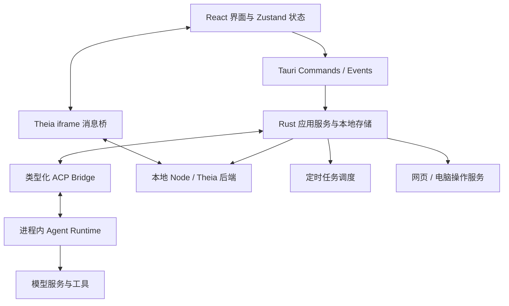

# EchoAgent 项目整体评审

评审日期：2026-09-26。版本：0.3.10。基准提交：`2fc6c47a`，以评审时的工作区源码为准。

## 结论

EchoAgent 已经具备一个本地 Agent 工作台的主要业务链路：模型连接、会话执行、权限干预、文件产物、代码验证、知识检索和定时任务都有实际实现。它适合继续做受控试点；在默认数据出站行为、进程停止、未发送内容恢复和真实桌面交付验证补齐之前，不宜把它视为已经完成稳定性收敛的通用桌面产品。

下一阶段应优先提高“交代任务之后是否可信、可恢复、可交付”，同时合并重复的产品概念。建议维持 Tauri、进程内 Runtime 和 Theia 的总体技术路线，进行模块化治理。

## 评审范围与证据

- 阅读 README、平台支持、Theia 集成、CI、构建和更新脚本；追踪 React 入口、状态管理、Tauri 命令以及关键 Runtime 适配逻辑。
- 重点检查首次使用、模型选择、任务发送与恢复、权限、知识与记忆、项目管理、代码任务、自动化、文件操作、通知、用量和更新链路。
- 定向阅读 vendored Runtime 的记忆检索，以及 vendored Theia 的关闭逻辑；未逐行审计全部第三方源码。
- 前端生产 TypeScript/TSX 约 69,918 行，排除测试和 foundation；CSS 约 25,788 行。`src-tauri/src` 约 73,384 行，包含内联测试。源码中有 307 处 Tauri command 标记。这些统计说明维护范围，不等同于质量评分。
- 当前已有一处用户改动：`vendor/theia-platform/examples/echo-coding-bridge/tsconfig.json`。本次未修改业务实现。
- 产品体验判断来自当前组件和状态流；未将文档截图视为当前版本实测，也未完成 Windows/macOS 打包应用的交互验收。

证据分为三类：**执行验证**、**源码确认**、**设计／架构建议**。优先级中 P1 表示下一次扩大使用前应处理，P2 表示后续版本需要安排。没有充分证据将本次问题定为 P0。

## 验证结果

| 检查 | 结果 | 范围说明 |
| --- | --- | --- |
| `pnpm test` | 191 个文件、1904 项测试通过 | 当前 Vite 配置纳入的前端测试 |
| `pnpm build` | 通过，包含 TypeScript 检查 | Vite 构建；不包含 Theia 编译和桌面安装包 |
| `cargo fmt --manifest-path src-tauri/Cargo.toml --check` | 通过 | 格式检查 |
| Runtime vendoring 检查 | 通过 | `verify-vendored-runtime.mjs` |
| 版本一致性检查 | 通过，0.3.10 | `release-version.mjs check` |
| 发布工具测试 | 3 项通过 | 用临时 Vitest 配置单独运行；默认 `pnpm test` 不纳入此文件 |
| 更新服务器 Python 测试 | 4 项通过 | `unittest discover` |
| `cargo test --locked --manifest-path src-tauri/Cargo.toml --lib -j 2` | 669 项通过、0 项失败、2 项忽略 | 编译约 38 分 34 秒，测试 8.95 秒；不含 `src-tauri/tests` 集成测试 |
| 定向缺陷复现实验 | 3 项均观察到预期缺陷 | 配置读取失败后写回默认值、路径大小写碰撞、重建 store 后队列／草稿丢失；临时测试文件已清理 |
| 取消子进程最小实验 | 确认缺陷对应的系统行为 | 杀死 Shell 后子进程仍写入临时标记，输出 EOF 继续等待约 0.57 秒 |

本机验证使用 Node.js 20.19.0、Rust 1.98.0。前端检查虽通过，但 Theia 明确要求 Node.js 22 或 24，本次结果不能替代规定环境下的 IDE 构建验证。

Rust 首次离线尝试缺少 `memo-map` 索引缓存，随后经授权运行联网测试并通过；过程中出现全局 Cargo 缓存写入／清理权限警告，未导致编译或测试失败。两项忽略测试分别需要真实 Agent 用户目录和已安装浏览器／桌面会话，本次未强制执行。

生产构建提示多个分块大于 500 kB，其中主入口 JS 约 687 kB、gzip 约 227 kB。分块警告本身不能证明启动卡顿，需要桌面实测。未运行完整 Clippy、真实模型调用、真实浏览器／电脑控制、实际更新安装和完整 Theia 构建。

## 产品与功能完整性

| 业务能力 | 源码体现的完成程度 | 主要缺口／边界 |
| --- | --- | --- |
| 通用任务 | 新建、切换模型、流式输出、权限卡、问答卡、取消、重试、历史与分叉均有实现 | 未发送队列和草稿缺少重启恢复；长会话性能缺少实测基线 |
| 模型与连接 | 区分个人、组织、内置来源；有连接测试、默认模型和失效提示 | 内置 HTTP 服务及记忆的独立服务来源没有形成一致的首次使用确认 |
| 工作区与文件 | 原生授权目录、路径检查、附件限制、文件树、预览和产物入口 | 多套文件入口的语义需要统一；备份与恢复不足 |
| 项目 | 指令、能力偏好、会话、计划、任务、资产和本机参与者备注 | 计划／任务重复；与代码工作台的任务实体尚未统一 |
| 代码开发 | Theia 编辑器、任务阶段、基线、变更审阅、验证、修复、验收和提交门禁 | 进程停止、验证检测和真实桌面 CI 是主要短板 |
| 并行代码任务 | Git worktree 隔离、提交后应用到原项目、运行中冲突约束 | 需要真实大仓库与跨平台验收；worktree 隔离不能代替进程沙箱 |
| Browser/Computer Use | 有实时能力检测、任务级上下文、暂停／接管、确认、浏览器网络边界 | 有单元测试和支持契约，仍需平台真实副作用、取消和退出验收 |
| 定时任务 | 后端调度、持久化 occurrence、队列恢复、并发限制和运行超时 | 终态双通道存在竞态；还需明确本机运行、休眠、权限等待与送达失败的边界 |
| 知识与记忆 | 个人知识源、组织检索、知识桥、记忆文件与摘要管理均有实现 | 记忆默认出站配置问题优先修复；知识源标识存在路径大小写问题 |
| 会议转写 | 有录音／导入、分片、部分失败、重试、纪要编辑和导出 | 当前能力与 MiniMax 连接关联，属于特定 Provider 能力，不能概括为所有模型支持 |
| 通知、WebDAV、用量 | 均有实际后端／界面链路，用量展示明确区分本机统计和服务商账单 | 用量配额只限制桌面手动发送；不能作为组织级预算控制 |
| 更新 | 使用 Tauri 更新器、签名校验、安装前复查版本、内置 CA | 更新源固定内网地址；开源版和组织部署需要独立发行配置 |

### 应保留的设计

1. **原生权限边界。** 自定义命令通过 `FilesystemAccess` 校验授权来源，文件选择与模型提供的字符串分开处理；这比仅在前端禁用按钮可靠。见 [shell_fs.rs:29](../../src-tauri/src/shell_fs.rs)。
2. **以证据决定交付。** 验证退出码、文件内容版本、Diff 审阅、验收证据和人工审查有明确建模。`orchestrator` 还检查缺失的验证命令，不能因某个门禁函数局部返回“不适用”就断言整个交付流程可绕过。见 [delivery.rs:290](../../src-tauri/src/coding/delivery.rs)、[orchestrator.rs:920](../../src-tauri/src/coding/orchestrator.rs)。
3. **定时任务由后端运行。** 已有持久化调度记录、恢复上下文、3 个并发名额和 30 分钟运行上限。见 [automations.rs:50](../../src-tauri/src/automations.rs)、[automations.rs:2252](../../src-tauri/src/automations.rs)。
4. **没有把全部能力都伪装成已完成。** 例如配额界面明确告知自动化不受手动发送配额限制，项目成员明确标注“本机备注”，Computer Use 的独立确认也有专门说明。
5. **有较多有价值的回归测试。** 快速切换会话、迟到事件、模型失效、权限等待、脏编辑器和任务基线都有针对性测试。需要补的是边界和集成验证。

## 需优先处理的具体问题

### R1 · P1 · 记忆服务覆盖用户配置，默认通过固定 HTTP 地址出站

**证据：源码确认。** [agent_runtime.rs:49](../../src-tauri/src/agent_runtime.rs) 定义固定模型、embedding 和 rerank 地址；`configure_memory_retrieval` 强制设置 API provider、endpoint、model、dimensions，并清空 API key、开启 reranker。在加载和解析有效配置后，启动流程仍于第 197 行调用该函数。记忆默认开启，见 [agent_config.rs:156](../../src-tauri/src/agent_config.rs)。

重排实现会将查询与候选记忆片段组装为请求并发送，见 [reranker.rs:50](../../vendor/echo-agent-build/crates/codegen/echo-agent-memory/src/reranker.rs)。因此使用个人／组织聊天模型，并不意味着记忆检索也使用同一服务；手工配置本地或其他记忆后端也会被宿主适配覆盖。

**用户影响：** 希望本机检索或指定服务处理记忆的用户无法得到配置预期；对网络链路和服务端的数据暴露范围不清晰。设置界面使用“启用本地记忆”“本地、可审阅”等文字，却未展示独立的远端检索服务。README 已披露 HTTP，模型连接详情也有明文提示，因此不是完全没有告知；缺口在默认流程与实际可配置性。见 [SettingsSections.tsx:369](../../src/components/SettingsSections.tsx)。

**建议：** 宿主只补齐缺省项；保留用户显式的 provider、endpoint 和认证配置。将“记忆文件在本机”和“远端向量化／重排”分开呈现；首次启用远端处理时展示服务来源。提供本机全文检索选项，内置服务切换到 HTTPS。

**验收：** 配置本机检索后，对内置远端服务的请求为零；自定义 endpoint 在重启后仍有效；关闭远端处理后，界面显示实际生效范围和时间。

### R2 · P1 · 验证取消／超时只杀死 Shell，子进程可能继续运行

**证据：源码确认＋本机最小实验。** [verification.rs:560](../../src-tauri/src/coding/verification.rs) 通过 `cmd /C` 或 `sh -lc` 执行命令；Unix 创建了进程组，但取消和超时分支只调用 `child.start_kill()`，随后无超时等待 stdout/stderr reader 结束。见同文件第 629—645 行。

本机使用相同的父 Shell／子进程／输出管道结构，在终止 Shell 后，子进程仍写入临时文件，管道 EOF 额外等待约 0.57 秒。此实验验证系统行为，未构造完整 Tauri `AppHandle` 去调用原函数。

**用户影响：** 点击停止后，测试、构建或脚本子进程仍可能占端口、消耗资源或继续写文件；继承管道的长驻子进程还会让“取消”迟迟不返回。

**建议：** 统一进程监督层。Unix 向进程组发送终止信号，给予有限退出时间后强杀；Windows 使用具有进程树生命周期约束的机制。取消后对 reader 收尾设置上限。可借鉴现有终端关闭逻辑 [coding_workspace.rs:361](../../src-tauri/src/coding_workspace.rs)，但要验证整组退出。

**验收：** shell → package manager → worker 的多级进程全部退出；“取消”在有限时间内返回；取消完成后无后续文件写入。

### R3 · P1 · Theia 切换项目／退出直接强杀后端，跳过清理生命周期

**证据：源码确认。** [theia.rs:36](../../src-tauri/src/theia.rs) 的 `stop` 和第 191 行的项目切换均调用 `Child::kill` 后 `wait`；没有发送可执行清理的关闭请求，也没有显式回收整棵子进程树。

vendored Theia 已实现 SIGTERM/SIGINT 下的 `gracefulShutdown`，包括 contributions 的 `onStop`、容器清理及正常 exit 阶段的进程树收尾，见 [backend-application.ts:224](../../vendor/theia-platform/packages/core/src/node/backend-application.ts)、同文件第 397 行。直接强杀不会执行这条清理路径。

**用户影响：** 后端扩展、语言服务或终端派生进程存在残留风险；快速切换项目时，旧工作区的后台活动未必与 UI 一起结束。未通过真实 Theia 桌面复现确认每一类子进程的最终行为。

**建议：** 先发受鉴权的关闭请求或平台正常终止信号，限时等待，再对受管理的进程树兜底清理；超时和残留要进入诊断日志。

**验收：** 有终端、语言服务和预览服务运行时反复切换项目／退出，旧服务全部退出，关闭日志显示清理已执行。

### R4 · P1 · 待发送队列和草稿在应用重启后丢失

**证据：源码确认＋定向复现。** [message-queue-store.ts:8](../../src/stores/message-queue-store.ts) 明确为仅内存状态，初始化 `queues: {}`，入队只更新 Zustand；[sessions-store.ts:123](../../src/stores/sessions-store.ts) 初始化 `drafts: {}`，第 179 行写草稿也只更新内存。临时测试入队、保存草稿后重建模块，确认两者均为空；这是 store 生命周期复现，未模拟整个桌面进程崩溃。

**触发：** 长任务执行中排队多条指令，或写好较长需求后，应用退出、更新重启、崩溃或 WebView 重建。

**用户影响：** 尚未真正发往 Runtime 的工作内容消失；“切换会话保留”并不等于“重启恢复”。

**建议：** 建立本地 outbox，持久化文本、附件引用、顺序、会话 ID 和发送幂等 ID；草稿单独保存。恢复时将不确定的发送状态呈现为待确认／可重试，依据 Runtime 已接收记录去重。

**验收：** 入队后重启可恢复；发送中崩溃不会重复执行副作用；附件丢失给出明确状态。

### R5 · P1 · 记忆配置读取失败后，仍允许以默认值覆盖真实配置

**证据：源码确认＋定向复现。** [SettingsSections.tsx:285](../../src/components/SettingsSections.tsx) 初始化为全部开启；`memoryConfigGet` 失败只设置消息，finally 将 loading 清除；控件没有加载失败禁用条件。切换任意选项会将整份 `next` 传给 `memoryConfigSave`；后端 [agent_config.rs:269](../../src-tauri/src/agent_config.rs) 保存全部字段。临时组件测试令读取请求拒绝，再关闭“自动整理”，实际观察到保存载荷中其余五项仍为 `true`。

**触发：** 真实配置里已关闭部分记忆能力，打开设置时 IPC 读取暂时失败，用户随后调整一个开关。

**用户影响：** 其他未读取到的关闭项可能被默认开启值覆盖；尤其会影响原先关闭的记忆能力。

**建议：** 未成功加载前禁止修改，提供重试；按字段更新，并用版本号或 revision 检查并发覆盖。同文件安全规则设置已有“加载失败不允许保存”的模式，可直接统一。

**验收：** 注入读取失败时，任何操作都不会触发保存；重试恢复后仅更改用户操作的字段。

### R6 · P1 · 本地限制策略读取异常时退化为无策略

**证据：源码确认。** [policy.rs:96](../../src-tauri/src/policy.rs) 将打不开、读取失败、超限和 JSON 损坏都返回空 `PolicySet`；第 149、164、172 行在缺少规则时允许模型、技能安装和功能使用。

**触发：** 已配置本地限制策略，但文件暂时无权读取或被损坏。

**用户影响：** “策略无法加载”被解释为“用户没有限制”，导致限制静默失效。这里指本地 policy store；不能据此断言组织的独立签名策略链路也被绕过，也不能把本地用户可编辑文件当作对操作系统账号的安全隔离。

**建议：** 区分首次不存在与已有策略不可读；对后者保留最后有效策略或阻止受限操作，展示可恢复错误。

**验收：** 策略存在但 JSON 损坏／权限错误时，原本禁止的操作不会因此被放开。

### R7 · P2 · 验证命令检测会生成项目没有配置的检查

**证据：源码确认。** [verification.rs:269](../../src-tauri/src/coding/verification.rs) 仅因存在 `pyproject.toml` 或 `requirements.txt` 就加入 pytest；仅因存在 `pyproject.toml` 就加入 `mypy .`。没有判断项目是否配置 pytest、mypy，也没有解析 uv／Poetry 等环境入口。

Maven 和 Gradle wrapper 同样固定使用 `./mvnw`、`./gradlew`，而验证执行器在 Windows 使用 `cmd`；未选择对应的 `.cmd`／`.bat`。见同文件第 235、252、560 行。这是跨平台适配缺口，本次没有 Windows 实机验证。

**用户影响：** 合法的 Python 项目可能因没有 mypy 被判失败，进入无意义的自动修复；Windows wrapper 工程可能无法运行已提供的验证工具。

**建议：** 把验证分成“检测到可执行”“环境未就绪”“项目未配置”“运行失败”。解析明确配置和 package manager，允许用户确认一次验证方案；平台选择正确 wrapper。环境缺失不应自动被诊断为业务代码缺陷。

**验收：** 无 mypy 的 pyproject 工程不出现强制类型检查；uv／Poetry 环境按其解释器执行；Windows Java 工程使用原生 wrapper。

### R8 · P2 · 路径统一转小写导致不同文件／知识源被合并

**证据：源码确认＋定向复现。** [kb-source-storage.ts:36](../../src/lib/kb-source-storage.ts) 使用 `normalized.toLowerCase()` 生成知识源 ID；[artifact-catalog.ts:97](../../src/lib/artifact-catalog.ts) 对路径转小写后作为合并键。临时测试直接调用现有函数，确认 `Docs` 与 `docs` 得到同一 ID，`A.txt` 与 `a.txt` 合并后仅剩一项。

**触发：** Linux 或大小写敏感的 macOS 卷中同时有 `Docs`、`docs`，或同一会话产出 `A.txt`、`a.txt`。

**用户影响：** 第二个知识源会被当作重复项；两个有效产物只能显示一个。文件系统实际身份与前端身份不一致。

**建议：** 由原生层提供规范化路径／稳定资源 ID，依据实际文件系统语义去重；不要对所有平台做全局小写化。已有数据迁移要保留可回退信息。

**验收：** 大小写敏感卷的两项分别存在、可查询、可删除；大小写不敏感卷仍能正确去重。

### R9 · P1 · CI 通过不足以证明代码工作台可交付

**证据：配置确认。** [.github/workflows/ci.yml:44](../../.github/workflows/ci.yml) 的 build job 只运行 `pnpm build`；现有 workflow 没有 Theia 编译、staging、smoke 或 Tauri 完整打包步骤。发布脚本有独立构建流程，因此不是“完全没有桌面构建脚本”。

此外，Rust 的主要测试命令使用 `--lib`，不会执行 `src-tauri/tests/model_config_test.rs` 和 `coding_workspace_async_test.rs`；[vite.config.ts:86](../../vite.config.ts) 只纳入 `src` 中的 ts/tsx 测试，漏掉 [release-tools.test.mjs](../../scripts/release-tools.test.mjs)。后者本次独立运行 3 项通过，说明是门禁遗漏，不能描述为代码测试失败。

**用户影响：** Theia 桥接源码不能编译、资源缺失、Node/native 模块架构不匹配等问题，可能在常规 CI 全绿时才于打包或安装后暴露。

**建议：** 普通 PR 至少增加 Theia bridge 类型／构建检查、Rust integration tests 和发布脚本测试；发布候选执行各支持平台的完整打包与 Theia smoke。按组件内容散列缓存重量级产物，避免每个 PR 无条件全量构建。

**验收：** 人为破坏桥接类型、移除 staged 后端入口或改变资源架构时，相应门禁明确失败；发布候选有可安装、可启动的产物证据。

### R10 · P1 · 定时任务的兜底完成可能抢先把取消／异常停止记为成功

**证据：源码确认的竞态结构，未做真实调度压力复现。** [agent_runtime.rs:658](../../src-tauri/src/agent_runtime.rs) 丢弃 `PromptResponse`，将正常收到响应统一转换为 `Ok(())`；[automations.rs:1844](../../src-tauri/src/automations.rs) 据此兜底写入 success。另一条通道在 `prompt_complete` 到达 bridge 后，才依据 stop reason／取消原因写入正确结果。

Runtime 的 [acp_agent.rs:1397](../../vendor/echo-agent-build/crates/codegen/echo-agent-runtime/src/agent/mvp_agent/acp_agent.rs) 使用 `forward_fire_and_forget` 发送完成通知；[gateway.rs:349](../../vendor/echo-agent-build/crates/codegen/echo-agent-acp/src/gateway.rs) 明确只入队、不等待处理完成。请求响应和通知处理之间没有这一步的完成屏障。

如果返回响应先被调度执行，兜底逻辑把记录变成 success；之后 [automations.rs:824](../../src-tauri/src/automations.rs) 只处理仍为 running 的记录，迟到的取消／失败通知不能纠正它。现有第 3154 行测试覆盖的是反方向：“失败先到，兜底成功后到不能覆盖”，没有覆盖这条时序。

**用户影响：** 用户停止或异常结束的定时任务在特定消息时序下可能显示成功，通知与运行记录不一致。此处问题是把请求结束当作任务成功；不是所有 API 错误都会走这条路径。

**建议：** 保留并解释 PromptResponse 的 stop reason 和终态元数据；最好按 `sessionId + promptId` 统一由持久化的 TurnCompleted 事件收敛终态。无权威终态时保持“待确认完成结果”，不要推定成功。

**验收：** 用可控调度分别让响应先到、通知先到、通知延迟或重放；取消、失败、成功始终得到相同的最终记录，且只发送一次最终通知。

## 产品设计优化

### 1. 合并项目“计划”和“任务”的重复实体

[ProjectDetailView.tsx:34](../../src/components/ProjectDetailView.tsx) 同时设置计划、任务页；[project-tabs.tsx:570](../../src/components/project-tabs.tsx) 与第 805 行两套实现都具备标题、模型、状态、Agent 启动、会话绑定、恢复、删除。业务区别目前不足以支撑两份实体及操作逻辑。

建议统一为项目工作项，支持列表／看板两种视图；需要时用类型区分目标、待办或里程碑。Agent 的执行步骤单独归属于工作项，避免与人工项目计划混淆。会话保留为沟通与执行记录，验收结果保留为任务状态。

### 2. 明确“本轮结束”和“任务验收完成”

[project-tabs.tsx:180](../../src/components/project-tabs.tsx) 已使用“本轮已结束”，并说明不代表项目任务完成；[Sidebar.tsx:126](../../src/components/Sidebar.tsx) 对同类会话状态仍显示“已完成”筛选。

建议统一三个层次：执行状态、任务状态、交付状态。用户可看到“本轮结束，待验收”，而不需要从多个面板猜测完成含义。保持现有代码门禁的证据要求，通用任务则提供轻量的成果确认。

### 3. 围绕“输入、执行、成果”整理信息入口

| 当前概念 | 用户容易混淆的点 | 建议 |
| --- | --- | --- |
| 项目、代码开发、最近工作区 | 不清楚一个目录是否属于同一个项目 | 项目统一身份，代码开发作为项目的一种工作视图 |
| 知识库、个人记忆、组织知识 | 不清楚是用户提供资料还是 Agent 自动记录 | 统一“上下文”入口，明确“资料”“记忆”，组织作为来源／范围 |
| 专家、技能、连接器、插件市场 | 需要先理解内部扩展模型 | 统一“能力”入口，以“能做什么／是否可用／来自哪里”为主，类型作为筛选 |
| 我的文件、项目资产、会话产物、代码变更 | 输入文件、生成成果和改动记录混在不同位置 | 输入归项目资料；生成成果统一汇总并可追溯到任务；代码变更保留专业审阅 |
| 自动化、Browser Use、Computer Use | “自动化”同时指调度和操作能力 | 将入口命名为“定时任务”；网页／电脑操作作为当前任务执行方式 |

这些是信息架构建议，需要小规模用户任务测试确认；不是要求一次性删除所有现有功能。组织入口可依据是否配置组织服务渐进展示，代码专业面板按使用场景展开。

### 4. 首次任务应让用户理解三件事

当前首页已收敛为单一输入入口，是值得保留的基础。应在首次发起时清晰展示：在哪个目录工作、使用哪个模型服务、哪些数据会发送到哪里。给出少量可直接填入的目标示例，并把选模型、选工作区、授权到首份成果串成一条路径。

当前 API 未就绪时的引导主要围绕手工填写 API Key，见 [HomePage.tsx:108](../../src/components/HomePage.tsx)。建议依据内置服务、个人连接、组织连接和网络失败分别显示下一步，避免把暂时不可用都变成“重新配置”。

### 5. 数据管理需要恢复能力

[SettingsSections.tsx:800](../../src/components/SettingsSections.tsx) 的数据管理主要是查看路径与在系统中打开。对长期使用的本地优先产品，用户还需要可验证备份、恢复预览、磁盘占用与清理范围。

`usage-quota.ts`、`artifact-catalog.ts` 和部分偏好仍依赖 WebView localStorage，因此只复制 `~/.echo-agent` 也不是当前完整用户状态的恢复方案。建议提供一个有版本、校验和明确内容清单的备份格式，默认排除凭据；恢复时逐项说明成功、跳过和失败。

### 6. 能力失败应保持可解释

网络、Provider、组织权限和浏览器环境失败，应显示具体受影响的能力及恢复入口。对于知识来源降级，结果旁展示本轮真正使用的来源；对于定时任务，区分任务执行成功与通知送达成功。当前存在静默跳过组织知识的专用展示逻辑，见 [ToolCallCard.tsx:51](../../src/components/ToolCallCard.tsx)，应避免用户把降级回答当作已完成组织检索。

## 技术架构与维护性

### 总体结构

总体分层合理：桌面端与模型解耦，Runtime 复用成熟执行能力，专业编辑体验交给 Theia。需要控制的是跨界面、跨线程、跨进程的状态一致性。

### A1 · P2 · 入口与状态编排职责过重

`App.tsx` 约 2767 行，`agent-client.ts` 约 2237 行，`session-store.ts` 约 1639 行；Rust 的 `org.rs`、`providers.rs`、`automations.rs` 也各自有数千行。长度只是迹象；更具体的问题是导航、模型选择、会话事件、队列调度、计费与知识同步共同修改跨模块状态。

建议依次按会话、代码任务、知识、能力连接、定时任务分出应用服务。界面负责展示和用户意图；执行状态由单一权威组件推进；状态镜像只负责订阅与恢复。`coding-task-runtime.tsx` 中自动验证与下一步执行依赖 React effect，后续可将持久化编排逐步收归 Rust，减少 WebView 生命周期对后台执行的影响。

不要一次重写。每次迁移一个完整流程，并保留当前已有的迟到事件、取消和恢复测试。

本次 Rust 验证也体现了构建反馈成本：宿主 `--lib` 测试仍需编译完整 Runtime 和大量工具依赖。可以优先将策略解析、状态转换、存储迁移等纯业务逻辑提取到依赖较少的 crate，使它们独立测试；桌面宿主继续承担集成验证。这个拆分应以实际依赖边界为依据，不以文件行数为依据。

### A2 · P2 · 持久化的可靠性标准不统一

已有值得复用的实现：`write_private_file` 使用唯一临时文件、权限收紧、同步与原子替换；coding store 有文件锁和 task transaction，且 `update_json` 遇到坏 JSON 会停止覆盖。

仍存在只保内存的 outbox／草稿、多个 localStorage 权威副本、部分读失败返回空状态、部分写失败静默吞掉。应制定统一存储接口：区分不存在、损坏、无权限与版本不兼容，写失败可见，有 schemaVersion、迁移、备份和恢复。并非所有 JSON 都需要立即迁移数据库；复杂关联和事务需求增长时，再优先迁移任务与 outbox。

Provider API Key 当前保存在 `config.toml`，README 已明确说明，Unix 文件权限也有保护。这属于已知的本机明文存储边界，不应误称为已经发生凭据泄露。面向长期组织部署，建议复用现有组织凭据保护机制，将个人 Provider Key 纳入系统凭据存储，并使普通备份默认不包含秘密。

### A3 · P2 · 长会话存在重复计算与全量渲染风险

[ChatView.tsx:732](../../src/components/ChatView.tsx) 在渲染中构建并遍历完整时间线；[MessageItem.tsx:85](../../src/components/MessageItem.tsx) 为普通组件，未隔离稳定历史消息；`session-store` 每个文本增量会更新消息数组。会话内查找还按消息更新扫描 DOM。

源码能确认这些重复工作，不能直接给出卡顿时间或最大可用消息数。建议先用 100、1000 条消息和持续工具输出建立 React commit、输入延迟和内存基线，再处理稳定消息 memo、增量批处理、历史分段和必要的虚拟化。虚拟化需同步保留查找、复制和滚动定位能力。

验证输出也应分块有界读取：[verification.rs:598](../../src-tauri/src/coding/verification.rs) 在整行读入并发出事件后才限制保留缓冲，因此超长无换行输出不受 512 KiB 保留上限保护。

### A4 · P2 · CSS 依赖层叠修补，组件边界不够稳定

`app.css` 约 15,068 行，`visual-polish.css` 约 4659 行，`coding-workbench.css` 约 3335 行，多个全局样式在入口一起加载。已有主题 token 和布局回归值得保留；建议按功能拆分样式所有权，减少同一选择器跨文件覆盖，为代码工作台按需加载样式，并补真实浏览器的关键尺寸截图验收。

### A5 · P2 · IPC 合约维护成本偏高

大量 Rust command、手工 TS 类型、字符串 invoke 与事件适配共同形成协议。现有合约测试有帮助，但部分测试只检查源码字符串，无法证明序列化形状和运行行为。

建议由 schema／Rust 类型生成或校验前端 DTO，统一错误码、requestId、sessionId、版本与可重试标识；为典型命令做真实序列化契约测试。307 是源码标记计数，不表示所有命令都应拆分成独立服务。

### A6 · P2 · 清理未接入的预研能力

生产调用搜索未找到 `sandbox-init.ts` 的自动激活入口、`container-executor.ts` 和 `oidc-auth.ts` 的业务使用链路；它们主要有自身实现与测试。`sandbox-guard` 的命令提示确有 UI 使用，但这不能证明 OS 沙箱执行器已经接入 Runtime。

建议将已运行、实验、废弃能力显式分类，清理误导性注释和未用依赖。保留确有近期计划的适配接口，避免用测试数量或文件存在来宣称功能完成。

## 整改安排与验收标准

| 顺序 | 工作包 | 完成标准 |
| --- | --- | --- |
| 1 | 数据出站与设置可靠性：R1、R5、R6 | 用户配置被尊重；远端来源可见；配置读取失败不会扩大行为范围 |
| 2 | 进程监督与终态：R2、R3、R10 | 进程树可确定回收；无取消后的写入；异常终态不被兜底成功覆盖 |
| 3 | outbox／草稿恢复：R4 | 崩溃、更新与重启后可恢复；发送去重与附件状态明确 |
| 4 | 发布门禁：R9 | 既有测试全部纳入；Theia 构建、资源 staging、桌面 smoke 有自动结果 |
| 5 | 验证方案与文件身份：R7、R8 | 不生成未配置的强制检查；跨平台路径身份正确 |
| 6 | 产品概念收敛 | 项目工作项统一；执行结束与验收完成一致；资料、能力与成果入口可理解 |
| 7 | 模块拆分、持久化统一、性能治理 | 每次迁移有真实用户流程回归和性能数据，减少跨模块状态写入 |

建议把以下流程作为每个发布候选的固定验收集：

1. 全新数据目录启动 → 明确模型和数据来源 → 选择目录 → 发起任务 → 查看产物。
2. 两个会话并行运行、切换目录，权限／问答／迟到事件始终归属正确会话。
3. 输入长草稿、排队多条消息，模拟进程中断后恢复并验证不会重复发送。
4. Git 工程存在用户未提交修改时执行代码任务，验证、审阅和回滚都保留正确基线。
5. 非 Git 目录和大型仓库的检查点、文件变更与恢复。
6. 子进程持续输出、无换行输出、超时和取消；确认停止后不再写文件。
7. Theia 有脏文件和后台服务时切项目与退出；确认保存、清理和重新打开。
8. 组织凭据失效、Provider 断网、知识检索降级时，用户能看到真实状态并恢复。
9. 定时任务跨重启、错过调度点、等待权限与通知失败时，执行记录可解释且不重复调度。
10. 从旧数据版本升级、恢复备份、安装签名更新；失败时能继续使用上一份有效数据。

这些验收应直接驱动后续测试补齐，优先覆盖本次发现的真实风险。
